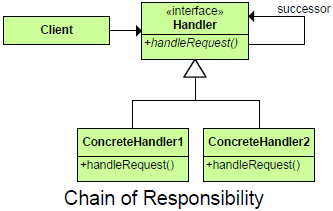

# ChainOfResponsibility #

**Chain of Responsibility** is a behavioral design pattern that lets you pass requests along a chain of handlers. Upon receiving a request, each handler decides either to process the request or to pass it to the next handler in the chain.

**Chain of responsibility Definition:** The Chain of responsibility design patter consists of a command(or request) and a series of processing objects that is handlers. A request is passed to the processing handler, upon receiving a request, each handler decides either to process the request or to pass it to the next handler in the chain.

**The Chain of responsibility design patter consists of:**

1. Command or request

2. A series of handlers.

**In the Chain of responsibility design pattern:**

1. A request is passed to the chain of processing handlers.

2. Where, Each receiving processing handler decides either to process the given request

3. Or , it makes a decision to pass the given request to the next processing handler in the chain.

## Intent ##

Avoid coupling sender of request to its receiver by giving more than one object chance to handle request.  Chain receiving objects and pass request along until an object handles it.

## Description ##

+ Decouple senders and receivers by giving multiple objects (in a set order) a chance to handle a request. Request passed until an object handles it.
+ 1st object in chain receives request - either handles it or forwards to next object in chain.
+ Object that makes request has no explicit knowledge of who will handle it - request has an implicit receiver.

## Image ##

## Participants ##

**Handler** – defines interface for handling requests. Can also implement successor link

**ConcreteHandler** – handles requests it is responsible for; otherwise forwards requests to successor.

**Client** – initiates request to a ConcreteHandler in the chain.

## Use Chain of Responsibility when ##

+ More than 1 object may handle a request, and handle isn’t known beforehand.
+ Want to issue request to one of several objects without specifying receiver explicitly.
+ Set of objects that can handle a request should be specified dynamically

## Consequences ##

## Benefits ##

+ Decoupling of senders and receivers, that is sender doesn’t need to know specifically who the handlers are
+ Added flexibility, while assigning the responsibility to the object
+ It allows to pass the request to another object, in case the current object cant handle the request

### Potential Drawbacks ###

+ Client can’t explicity specify who handles a request
+ Some requests may end up unhandled
