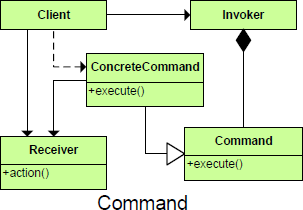

##Purpose
	Encapsulates a request allowing it to be treated as an object. This allows the request to be handled in traditionally object based relationships such as queuing and callbacks.
##Intent
	Encapsulate a request as an object, thereby letting you parameterize clients with different requests, queue or log requests, and support undoable operations.
	OR
	The client instantiates the command object and provides it with a receiver object to handle a request.An invoker then obtains the command, referencing it via its interface, and invokes its execute method, which in turn calls into the receiver’s specific method to handle the request.
	OR
	The Command pattern is most useful when dealing with a request that you have no prior knowledge of what operation to perform in response to it. There are four parts to the Command pattern: the client, the invoker, the receiver, and of course the command.
	OR
	Encapsulates a method as an object and separates the execution of a command from its invoker.

##

##

##Participant

	Client(User of the editor, who selects a Cut command on a menu)
		Creates and executes Commands
		The client instantiates the command and passes it on to the invoker	
	ICommand(Menu)
		An interface that specifies the Execute operation
		The abstract command may also houses the reference of the receiver to which its subclasses are bound.
	Command(Holder of a Cut request)
		A class that implements the Execute operation by invoking operations on the	Receiver
	Invoker(Process the selection of a Cut option)
		Asks the Command to carry out the Action
		The invoker takes the command and holds it.	At some point, it may call the command’s execute method.
		The object that invokes the execute behavior of a concrete command.
	Receiver(An object that can perform a Cut)
		Any class that can perform the required Action
		The receiver is the object that is actually performing the action.
	Action(Cut)
		The operation that needs to be performed

##Key Features of the Command Pattern
	The primary usefulness of the command pattern is the flexibility and extensibility it affords when defining behavior in applications.
	• The command pattern encapsulates behavior in a portable command object.
	• The command pattern decouples the classes and which methods in those classes execute required behavior from the location where the behavior is called.
	• The command pattern allows a client to dynamically create new behavior by creating new command objects and assigning them to invokers at runtime.
	• The command pattern allows for straightforward implementation of command chaining, undo, redo and logging features into an application.

##Use the Command pattern when
	You have:
		• Commands that different receivers can handle in different ways
		• A high-level set of commands that are implemented by primitive operations
	You want to:
		• Specify, queue, and execute commands at different times
		• Support an Undo function for commands
		• Support auditing and logging of all changes via commands
