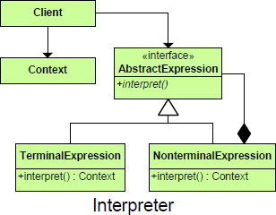

README

## Purpose
	Defines a representation for a grammar as well as a mechanism to understand and act upon the grammar.

## Intent
	Given a language, define a represention for its grammar along with an interpreter that uses the representation to interpret sentences in the language.
	OR
	Interpreter Specifies how to evaluate sentences in a language.

##

##

##Participants

**AbstractExpression**

	declares an interface for executing an operation
**TerminalExpression**

	implements an Interpret operation associated with terminal symbols in the grammar. an instance is required for every terminal symbol in the sentence.
**NonTerminalExpression**

	interprets all of the nonterminal expressions  in the grammar.
**Context**

	contains the global information that is part of the parser—in this case, the token stack.
**Client**

	invokes the Interpret operation.

## Use When
+	There is grammar to interpret that can be represented as large syntax trees.
+	The grammar is simple.
+	Efficiency is not important.
+	Decoupling grammar from underlying expressions is desired.

##  Consequences  ##

1. Easily extensible grammar
1. Implementing grammar is easy
1. Complex grammar is difficult to manage
1. Can easily add new ways to interpret expressions through the Visitor.
