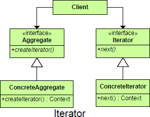

README

# Purpose
	Allows for access to the elements of an aggregate object without allowing access to its underlying representation.
## Intent ##
	Provide a way to access the elements of an aggregate object sequentially without exposing its underlying representation.
	OR
	Provides a way to navigate a collection in a formalized manner.

##

##

## Participants ##
	Iterator
		defines an interface for accessing and traversing elements.
	ConcreteIterator
		implements the Iterator interface.
		keeps track of the current position in the traversal of the aggregate.
	Aggregate
		defines an interface for creating an Iterator object.
	ConcreteAggregate
		implements the Iterator creation interface to return an instance of the proper ConcreteIterator

## Motivation ##
	An aggregate object such as a list should allow a way to traverse its elements without exposing its internal structure
	It should allow different traversal methods
	It should allow multiple traversals to be in progress concurrently
	But, we really do not want to add all these methods to the interface for the aggregate

# Use When
	Access to elements is needed without access to the entire representation.
	Multiple or concurrent traversals of the elements are needed.
	A uniform interface for traversal is needed.
	Subtle differences exist between the implementation details of various iterators.

## Consequences ##
	There are three major consequences.
	1. Iterator Pattern supports variations in the traversal of an aggregate. Every time you want to change the traversal algorithm, you just replace the iterator instance with a different one.
	2. Iterators simplify the Aggregate interface.
	3. More than one traversal can be pending on an aggregate. An iterator keeps track of its own traversal state. Therefore you can have more than one traversal in progress at once.

# Benefits
	1. 	Simplifies the interface of the Aggregate by not polluting it with traversal methods
	2. 	Supports multiple, concurrent traversals
	3. 	Supports variant traversal techniques

