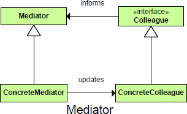

README

## Purpose ##
	Allows loose coupling by encapsulating the way disparate sets of objects interact and communicate with each other. Allows for the actions of each object set to vary independently of one another.
## Intent ##
	Define an object that encapsulates how a set of objects interact. Mediator promotes loose coupling by keeping objects from referring to each other explicitly, and it lets you vary their interaction independently.
	OR
	The Mediator pattern is there to enable objects to communicate without knowing each other’s identities. It also encapsulates a protocol that objects can follow.
	OR
	Defines an object that allows communication between two other objects without them knowing about one another.
	OR
	Define a central class that acts as a message routing service to all other classes.

##

##

## Participants ##
	● Mediator
		❍ defines an interface for communicating with Colleague objects.
		❍ Broadcasts sent messages to all signed-on Colleagues using the Respond delegate
	● ConcreteMediator
		❍ implements cooperative behavior by coordinating Colleague objects.
		❍ knows and maintains its colleagues.
	● Colleague classes
		❍ each Colleague class knows its Mediator object.
		❍ each colleague communicates with its mediator whenever it would have otherwise communicated with another colleague.

## Consequences ##

	*Advantages*
	1. Comprehension - The mediator encapsulate the logic of mediation between the colleagues. From this reason it' more easier to understand this logic since it is kept in only one class.
    2. Decoupled Colleagues - The colleague classes are totally decoupled. Adding a new colleague class is very easy due to this decoupling level. You can add new controls or other classes without changing anything except the Mediator.    3.
    3. Simplified object protocols - The colleague objects need to communicate only with the mediator objects. Practically the mediator pattern reduce the required communication channels(protocols) from many to many to one to many and many to one.
    4. Limits Subclassing - Because the entire communication logic is encapsulated by the mediator class, when this logic need to be extended only the mediator class need to be extended.

	*Disadvantages*
    1. Complexity - in practice the mediators tends to become more complex and complex. A good practice is to take care to make the mediator classes responsible only for the communication part. For example when implementing different screens the the screen class should not contain code which is not a part of the screen operations. It should be put in some other classes.
    2. The Mediator can become a “god class,” having too much knowledge of the rest of the program. This can make it hard to change and maintain. Sometimes you can improve this situation by putting more of the function into the inditasks, and the Mediator should only manage the interaction between objects.

## Use Mediator When ##
	• Objects communicate in well-structured but potentially complex ways.
	• The objects’ identities should be protected even though they communicate.
	• Some object behaviors can be grouped and customized.

## Notes ##
	Implementation
		Key points of the Mediator pattern are:
		• Each Colleague is passed a Mediator at instantiation and keeps it as a private reference.
		• Each Mediator keeps a list of signed-on Colleagues as a private reference.
