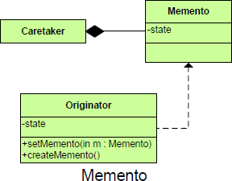

# Memento #

## Purpose ##

Allows for capturing and externalizing an object’s internal state so that it can be restored later, all without violating encapsulation.

## Intent ##

1. Without violating encapsulation, capture and externalize an object’s internal state so that the object can be returned to this state later.
**OR**
2. Allows you to restore an object to its previous state.

## Image ##

## Participants ##

	Originator:
		A class that has state to be saved
		Creates and uses a memento.
		Creates a memento containing a snapshot of its own current internal state.
		Uses the memento to restore its internal state.
	Caretaker:
		A class that is a holder for the mementos
		Invokes the originator.
		is responsible for the memento's safekeeping
		The memento is opaque to the caretaker, But never operates on or examines the contents of a memento.
	Memento:
		A class for objects representing the Originator’s saved state
		A black box.
		The memento must not reveal its contents to anything other than the originator
		the lock box that is written and read by the Originator, and shepherded by the Caretaker.
	Client:
		Keeps a copy of the originator

## Motivation ##

It is sometimes necessary to capture the internal state of an object at some point and have the ability to restore the object to that state later in time. Such a case is useful in case of error or failure. OR For most applications it is important to allow the users to "undo" an operation or to return to a previous state.

## Benefits ##

+ Simplifies originator
+ State reversion
+ Preserving encapsulation boundaries.
+ Increased cohesion

## Drawbacks ##

+ Memory consumption
+ Additional classes
+ Speed of object initialization, depending on how often mementos are initialized
+ Bulks up the caretaker

## Notes ##

The Memento pattern is interesting because it has two interfaces:

+ A wide interface to the Originator that enables it to access everything that needs to be saved or restored
+ A narrow interface to the Caretaker that can keepand pass on memento references, but no more
+ The Memento class keeps the state of the Originator but does not allow other classes to access that state. It therefore preserves encapsulation boundaries, relieving the Originator of this responsibility
