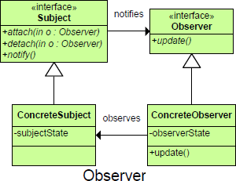

##Purpose
	Lets one or more objects be notified of state changes in other objects within the system.

##Intent
	Defines the way one or more classes can be alerted to a change in another class.
	OR
	The Observer pattern defines a relationship between objects so that when one changes its state, all the others are notified accordingly. There is usually an identifiable single publisher of new state, and many subscribers who wish to receive it.	

##

##

##Motivation
	The need to maintain consistency between related objects without making classes tightly coupled

##Participants
	Subject
		The class whose instances independently change their state and notify Observers
		Keeps track of its observers
		Provides an interface for attaching and detaching Observer objects
	Observer		
		An interface for Observers specifying how they should be updated
	ConcreteSubject
		The object being observed
		Stores state of interest to ConcreteObserver objects
		Sends a notification to its observers when its state changes
	ConcreteObserver		
		The observing object
		maintains a reference to a ConcreteSubject object
		Stores state that should stay consistent with the subject's
		Implements the Observer update interface to keep its state consistent with the subject's
	Update
		The operation that forms the interface between the Subject and the Observers
	Notify
		The event mechanism for calling the Update operation on all Observers

##Use When	
	An abstraction has two aspects, one dependent on the other.
	State changes in one or more objects should trigger behavior in other objects
	A change to one object requires changing others.
	An object should be able to notify other objects without making assumptions about the objects.

##The pattern’s benefits are as follows: 
	• Synchronizes state-dependent objects 
	• Uses a one-to-many relationships 
	• Lets subjects and observers also be observers and subjects
	• Support for event broadcasting
	• Observers can be added without modifying the subject
	• Subject and observer can belong to different abstraction layers
	• Subject does not need to know the concrete class of an observer, just that each observer implements the update interface
##And it has these drawbacks:
	• Object lookup speeds can affect performance. 
	• It may cause redundant notifications. 
 
##Consequences
	Vary subjects and observers independently.
	Abstract coupling between Subject and Observer.
	Support for broadcast communication.
	Simple update to Server may cause a cascade of updates to Observer and its dependent objects.
