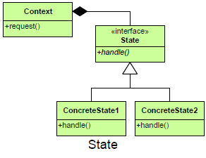

README

## Purpose

Ties object circumstances to its behavior, allowing the object to behave in different ways based upon its internal state.

## Intent ##

Allow an object to alter its behavior when its internal state changes. The object will appear to change its class.

##

## Participants ##

Context
+ defines the interface of interest to clients
+ maintains an instance of a ConcreteState subclass that defines the current state.

State
+ defines an interface for encapsulating the behavior associated with a particular state of the Context.
+ The State represents the interface that defines the behavior dependent on the state of the Context.

ConcreteState
+ ConcreteState(s) represent specific states in the lifetime of the Context.  They implement behavior specific to these states.

## Motivation ##

+ The State pattern is useful when you want to have an object represent the state of an application, and you want to change the state by changing that object.
+ The State pattern is intended to provide a mechanism to allow an object to alter its behavior in response to internal state changes. To the client, it appears as though the object has changed its class.
+ The benefit of the State pattern is that state-specific logic is localized in classes that represent that state.

## Use State When ##

+ The behavior of an object should be influenced by its state. An object’s behavior depends on its state and changes its behavior at run-time.
+ Complex conditions tie object behavior to its state.
+ Transitions between states need to be explicit.
+ you want to have an object represent the state of your application and switch application states by switching objects.

## Consequences ##

+ It localizes state-specific behavior and partitions behavior for different states.
+ It makes state transitions explicit.
+ State objects can be shared.

## Collaborations ##

+ Context delegates state-specific requests to the current ConcreteState object.
+ A context may pass itself as an argument to the State object handling the request.  This lets the State object access the context if necessary.
+ Context is the primary interface for clients.  Clients can configure a context with State objects.  Once a context is configured, its clients don’t have to deal with the State objects directly.
+ Either Context or the ConcreteState subclasses can decide which state succeeds another and under what circumstances.

# Key Features
The following key features characterize the State design pattern:
+ States exist internally as part of an object.
+ Objects change in certain ways when states change. Objects may appear to change classes, but they’re changing behavior that is part of the class.
+ Each state’s behavior depends on the current state of other states in the object

<!--stackedit_data:
eyJoaXN0b3J5IjpbODM0MjM3ODNdfQ==
-->
