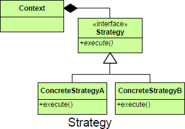

# Strategy #

## Purpose ##

Defines a set of encapsulated algorithms that can be swapped to carry out a specific behavior.

## Intent ##

Define a family of algorithms, encapsulate each one, and make them interchangeable. Lets the algorithm vary independently from clients that use it.

## Intent 2 ##

The Strategy pattern encapsulates a set of algorithms uniformly (sibling subclasses that inherit a common interface) to achieve interchangeability among them.

## Image ##

## Participants ##

**Context:**	A class that maintains contextual information for an IStrategy object’s algorithm to work on the Context class is the traffic cop that decides which strategy is to be called.
**IStrategy:** Defines an interface common to all the strategies Context uses this interface to call the algorithm defined by a ConcreteStrategy
**StrategyA, StrategyB:** Classes that include algorithms that implement the IStrategy interface
**Client:** Any aspect of the application or system that has prior knowledge of the concrete strategy to be used by the context

## Use Strategy When ##

+ Many related classes differ only in their behavior.
+ There are different algorithms for a given purpose, and the selection criteria can be codified.
+ The algorithm uses data to which the client should not have access
+ The behavior of a class should be defined at runtime.
+ Conditional statements are complex and hard to maintain.
+
+ The only difference between many related classes is their behavior.
+ Multiple versions or variations of an algorithm are required.
+ Algorithms access or utilize data that calling code shouldn’t be exposed to.
+ The behavior of a class should be defined at runtime.
+ Conditional statements are complex and hard to maintain.

## Motivation ##

Objects have responsibilities.
Different, specific implementations of these responsibilities are manifested through the use of polymorphism.
There is a need to manage several different implementations of what is, conceptually, the same algorithm.
It is a good design practice to separate behaviors that occur in the problem domain from each other— that is, to decouple them. This allows me to change the class responsible for one behavior without adversely affecting another.

## Examples

+ Save files in different formats
+ Compress files using different algorithms
+ Capture video data using different compression schemes
+ Use different line-breaking strategies to display text data
+ Plot the same data in different formats: line graph, bar chart, or pie chart
+ related classes differ only in their behavior.
+ There are different algorithms for a given purpose, and the selection criteria can be codified.
+ The algorithm uses data to which the client should not have access.

## Benefits ##

+ Algorithms can be used among varying systems
+ Algorithms can be more easily maintained
+ Algorithms can be interchanged both during development and at runtime
## And it has these drawbacks ##

+ Clients must be aware of the strategies.
+ Strategies are more objects to manage.

## Key Features ##

+ Define and encapsulate a family of algorithms.
+ Make encapsulated algorithms interchangeable.
+ Allow algorithms to change independently from the clients that use it.

## Notes ##

The Strategy pattern involves removing an algorithm from its host class and putting it in a separate class.
