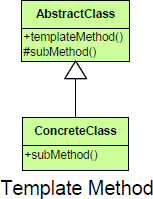

README

**Class (change class relationships at compile time)**

## Purpose
Identifies the framework of an algorithm, allowing implementing classes to define the actual behavior.

## Intent
Defines the skeleton of an algorithm in a method, deferring some steps to subclasses. Template method lets subclasses redefine certain steps of an algorithm without changing the algorithm’s structure.

## Description

## Motivation

##

##

## Participant
### Abstract class
+   Defines abstract primitive operations that concrete subclasses define to implement steps of an algorithm.
+   Implements a template method defining the skeleton of an algorithm. The template method calls primitive operations as well as operations defined in AbstractClass or those of other objects.

### Concrete class
+   Implements the primitive operations to carry out subclass-specific steps of the algorithm.

## Collaborations
+   ConcreteClass relies on AbstractClass to implement the invariant steps of the algorithm.

## Use Template When
+   A single abstract implementation of an algorithm is needed.
+   Common behavior among subclasses should be localized to a common class.
+   Parent classes should be able to uniformly invoke behavior in their subclasses.
+   Most or all subclasses need to implement the behavior.

## CONSEQUENCES

## Benifit

## Potential Drawbacks
+   Operations which must be overridden by a subclass should be made abstract
+   When inheritance is used as the way to add new functionality, it becomes impossible to add functionality in more than one axis at the same time without defining more and more classes.  This kind of system can rapidly become fragile. Changes at any one level can disturb operation above or below that level in the template methods. There is often a feeling of unpredictability when adding new functionality as it difficult to predict how behavior will change in all cases. You often also tend to build finer and finer tweaks by splitting the algorithmic parts of the template class and inserting more layers, thus exacerbating the problem.

## How does the Template Method Works?
+   Define an abstract base class with some fully qualified method containing common implementation logic
+   Declare the abstract methods for subclasses to override specific behaviors
+   Declare a Template method in a superclass that holds the core algorithm implementation steps
+   Derived classes can override placeholder methods
+   Derived classes can override implemented methods

## Intent 2
The template method design pattern belongs to the behavioral family of patterns that defines the steps for an algorithm and allows the subclass to provide the implementation for one or more steps. This design pattern helps in maximizing the code reusability.

## Intent 3
Sometimes you want to specify the order of operations that a method uses, but allow subclasses to provide their own implementations of some of these operations

## Misc
+   The Template method should be declares as final to avoid its subclass overriding its implementation logic.
+   The template method in a super class follows the Hollywood principle, Don’t call us, we’ll call you. This refers to the fact that instead of calling the base class methods in the subclasses, the methods from the subclass are called form super class template method.

## Guideline
Use Template Methods to delegate to subclasses.

