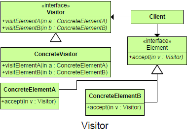
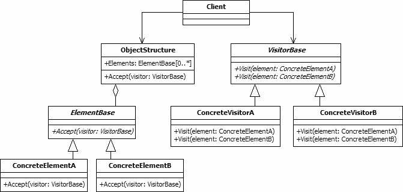

## Purpose
Allows for one or more operations to be applied to a set of objects at runtime, decoupling the operations from the object structure.
	
## Intent
Define an operation to be performed over a complex object structure without changing the elements on which it operates.	Enables new functionality to be performed on a class without affecting its structure.

# Motivation
+	Desire to keep the logic together; as opposed to distributing the code over all classes that can be in the object structure
+	Support frequent addition of new operations

##

##

## Participant

+	Client
		A class that creates and maintains the object structure; instantiates and calls the Visitors
+	ObjectStructure
		A composite structure of several related element types
+	IVisitor
		An interface for all the Visitor classes
+	Visitor1 and Visitor2
		Classes that contain methods that iterate through the object structure and apply operations to its elements
+	Element
		defines an accept operation that takes a visitor as an argument
+	ElementA and ElementB
		implements an accept operation that thakes a visitor as an argument
		
#Use Visitor When
+	When you want to perform an operation on the data contained in a number of objects that have different interfaces. and if you have to perform a number of unrelated operations on these classes.
+	Visitors are a useful way to add function to class libraries or frameworks for which you either do not have the source or cannot change the source for other technical (or political) reasons. In these latter cases, you simply subclass the classes of the framework and add the accept method to each subclass.
+	You have a class hierarchy that is effectively sealed.
+	There are many distinct operations to perform on it.
+	The operations are orthogonal to the core purpose of the types in the hierarchy.
+	You need the flexibility to define new operations over time.
+	An object structure must have many unrelated operations performed upon it.
+	The object structure can’t change but operations performed on it can.
+	Operations must be performed on the concrete classes of an object structure.
+	Exposing internal state or operations of the object structure is acceptable.
+	Operations should be able to operate on multiple object structures that implement the same interface sets.

#CONSEQUENCES

## Benifit
+	Single visitor object is used to visit all elements of the Item classes.
+	If the logic of operation changes, then we need to make change only in the visitor implementation rather than doing it in all the item classes.
+	Adding a new item to the system is easy, it will require change only in visitor interface and implementation. The existing item classes will not be affected.

##Potential Drawbacks
