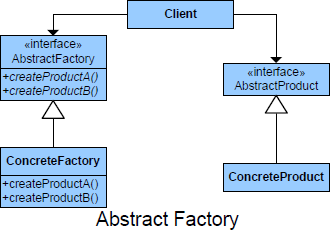

##Intent

+	Provide an interface for creating families of related or dependent 
objects without specifying their concrete classes
+	This pattern supports the creation of products that exist in families and are designed to be produced together. The abstract factory can be refined to concrete factories, each of which can create different products of different types and in different combinations.

##Purpose
Enables a class to delegate the responsibility of creating a valid object.

##

##

##Participants

+	AbstractFactory: Declares an interface for operations that create abstract product objects
+	ConcreteFactory: Implements the operations to create concrete product objects
+	AbstractProduct: Declares an interface for a type of product object
+	ConcreteProduct: Defines a product object to be created by the corresponding +	Concrete factory: Implements the AbstractProduct interface
+	Client: Uses only interfaces declared by AbstractFactory and AbstractProduct classes

##Use Builder when

+	Need to abstract from details of implementation of products.
+	Need to have multiple families of products.
+	Need to enforce families of products that must be used together.
+	Need to hide product implementations and just present interfaces.

##Collaborations
+	The creator relies on its subclasses to define the factory method so that it 
returns an instance of the appropriate subclass

##CONSEQUENCES

**Benefits**

+	Isolates Concrete Class Names from Usages (Clients)!
+	Makes Exchanging Product Families Easy (Single Usage) 
+	Promotes Consistency (Products from Same Factory)

**Potential Drawbacks**

+	Supporting new Products Means a New Interface 
+	Subclass Specific Operations May Require Runtime Dependent Casting 

