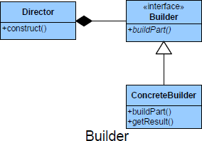

# Builder #

## Definition ##

Builder is an object creational design pattern that codifies the construction process outside of the actual steps that carries out the construction - thus allowing the construction process itself to be reused.

## Purpose ##

+ Enables various versions of an object to be constructed by separating the construction for the object itself.
+ The Builder pattern assembles a number of objects to make a new object,
based on the data with which it is presented. Frequently, the choice of which
way the objects are assembled is achieved using a Factory.

## Intent ##

*	Separate the construction of a complex object from its representation so that the same construction process can create different representations.

## Image ##

## Participants ##

+ IBuilder: An interface defining what can be built
+ Director: A sequence of operations that can be followed to create a Product
+ ConcreteBuilder: A class that is called by a Director to make Product parts
+ Product: The object under construction, by parts

## Use Builder when ##

+ Need to isolate knowledge of the creation of a complex object from its
parts.
+ Need to allow different implementations/interfaces of an object's parts.

+ The algorithm for creating parts is independent from the parts themselves.
+ The construction process must allow different representations for the object that's constructed.
+ You need fine control over the construction process.

## Collaborations ##

+ The client creates the Director object and configures it with the desired Builder object.
+ Director notifies the builder whenever a part of the product should be built.
+ Builder handles requests from the director and adds parts to the product.
+ The client retrieves the product from the builder.

## Consequences ##

## Benefits ##

+ Encapsulation: The builder pattern encapsulates the construction process of a complex object and thereby increases the modularity of an application.
+ A builder lets you vary an object’s representation without changing the way the object is constructed.
+ Give control over the build process.

**Potential Drawbacks**

+ Requires creating a separate ConcreteBuilder for each different type of Product

