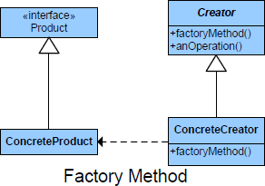

README

Also Known as **Virtual Constructor**

The Factory method deals with creating instances without specifying the exact class of the object that will be created.
Factory pattern allows user to create an object without exposing the creation logic to the client code/main code/concrete class, enabling the client to refer the newly created object using the common interface.

This design pattern is based on one of the OOPs concepts - encapsulation. In general, we write object creation code at the client side, but in the factory pattern, we delegate the object creation responsibility to the subclass code that is factory code. So, depending on the data provided to the factory, it can return an object of one of several possible classes.

## Intent ##

+	Define an interface for creating an object, but let subclasses decide which class to instantiate. Factory Methode lets a class defer instantiation to subclasses.

## Purpose ##

Enables a class to delegate the responsibility of creating a valid object.

##

## Participants ##

+ Product: defines the interface for objects the factory method creates.
+ ConcreteProduct: implements the Product interface.
+ Creator:(also refered as Factory because it creates the Product objects) declares the method FactoryMethod, which returns a Product object. May call the generating method for creating Product objects
+ ConcreteCreator: Overrides the generating method for creating ConcreteProduct objects and Decides which class to instantiate.

## Use Factory when ##

+	When a class doesn't know what sub-classes will be required to create.
+	When a class wants that its sub-classes specify the objects to be created.
+	When the parent classes delegate responsibility to one of several helper subclasses.

## Collaborations ##

+	The creator relies on its subclasses to define the factory method so that it returns an instance of the appropriate subclass

## Consequences ##

**Benefits**

+	Factory Method Pattern allows the sub-classes to choose the type of objects to create.

+	The Factory Pattern promotes loose coupling by eliminating the need to bind application-specific classes into the code. That means the code interacts solely with the resultant interface or abstract class, so that it will work with any classes that implement that interface or that extends that abstract class.

**Potential Drawbacks**

+	The factory has to be used for a family of objects. If the classes doesn’t extend common base class or interface they cannot be used in a factory design template.

## Conclusion

The main reason the factory pattern is used is that it introduces weak coupling instead of tight coupling, hiding concrete classes from the application. It provides customization hooks and the implementation comfortably accommodates new changes.
