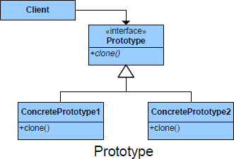

README

## Definition ##

Allows classes to be copied or cloned from a prototype instance rather than creating new instances.

## Purpose ##

The Prototype pattern copies or clones an existing class, rather than creating
a new instance, when creating new instances is more expensive.

## Intent ##

*	Specify the kinds of objects to create using a prototypical instance, and create new objects by copying this prototype.
*	Reduce complex initialisation and constructor processing and instead clone an exist instance

## Image ##

## Participants ##

+ Prototype: Declares an interface for cloning itself
+ ConcretePrototype: Implements an operation for cloning itself
+ Client: Creates a new object by asking a prototype to clone itself

## Use Prototydpe when ##

+ When the class to instantiate are specified at run-time, for example, by dynamic loading.
+ To avoid building a class hierarchy of factories that parallels the class hierarchy of products.
+ When instances of a class can have one of only a few different combinations of state
+ Need to be independent of how its products are created, composed, and
represented.

## Consequences ##

**Benefits**

**Potential Drawbacks**

+ Initializing clones using deepcopy

