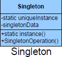

##Intent
Ensure a class only has one instance, and provide a global point of access to it.

##Purpose

The purpose of the Singleton pattern is to ensure that there is only one instance of a class, and that there is a global access point to that object. The pattern ensures that the class is instantiated only once and that all requests are directed to that one and only object. Moreover, the object should not be created until it is actually needed. In the Singleton pattern, it is the class itself that is responsible for ensuring this constraint, not the clients of the class.

##

##

##Participants

+	Singleton: The class containing the mechanism for a unique instance of itself

##Use Builder when

+	You need to ensure there is only one instance of a class.
+	Controlled access to that instance is essential.

##Collaborations
+	Other objects can only use the single instance of that object.
 
##CONSEQUENCES

+	It can be difficult to subclass a Singleton, since this can only work if the base Singleton class has not yet been instantiated.
+	 You can easily change a Singleton to allow a small number of instances where this is allowable and meaningful.

**Benefits**
+	Controlled access to sole instance.

**Potential Drawbacks**

