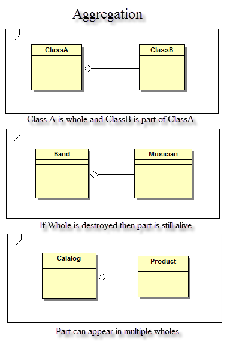
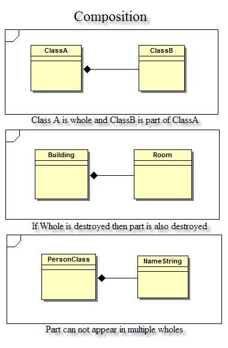
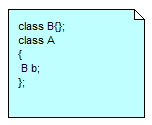
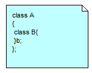

<html xmlns:v="urn:schemas-microsoft-com:vml"
xmlns:o="urn:schemas-microsoft-com:office:office"
xmlns:w="urn:schemas-microsoft-com:office:word"
xmlns:m="http://schemas.microsoft.com/office/2004/12/omml"
xmlns="http://www.w3.org/TR/REC-html40">

<head>
<meta http-equiv=Content-Type content="text/html; charset=windows-1252">
<meta name=ProgId content=Word.Document>
<meta name=Generator content="Microsoft Word 15">
<meta name=Originator content="Microsoft Word 15">
<link rel=File-List href="AggregationAndComposition_files/filelist.xml">
<link rel=Edit-Time-Data href="AggregationAndComposition_files/editdata.mso">
<!--[if !mso]>

<![endif]-->
<link rel=themeData href="AggregationAndComposition_files/themedata.thmx">
<link rel=colorSchemeMapping
href="AggregationAndComposition_files/colorschememapping.xml">
<!--[if gte mso 9]><xml>
 <w:WordDocument>
  <w:TrackMoves>false</w:TrackMoves>
  <w:TrackFormatting/>
  <w:ValidateAgainstSchemas/>
  <w:SaveIfXMLInvalid>false</w:SaveIfXMLInvalid>
  <w:IgnoreMixedContent>false</w:IgnoreMixedContent>
  <w:AlwaysShowPlaceholderText>false</w:AlwaysShowPlaceholderText>
  <w:DoNotPromoteQF/>
  <w:LidThemeOther>EN-IN</w:LidThemeOther>
  <w:LidThemeAsian>X-NONE</w:LidThemeAsian>
  <w:LidThemeComplexScript>X-NONE</w:LidThemeComplexScript>
  <w:Compatibility>
   <w:BreakWrappedTables/>
   <w:SplitPgBreakAndParaMark/>
  </w:Compatibility>
  <w:BrowserLevel>MicrosoftInternetExplorer4</w:BrowserLevel>
  <m:mathPr>
   <m:mathFont m:val="Cambria Math"/>
   <m:brkBin m:val="before"/>
   <m:brkBinSub m:val="&#45;-"/>
   <m:smallFrac m:val="off"/>
   <m:dispDef/>
   <m:lMargin m:val="0"/>
   <m:rMargin m:val="0"/>
   <m:defJc m:val="centerGroup"/>
   <m:wrapIndent m:val="1440"/>
   <m:intLim m:val="subSup"/>
   <m:naryLim m:val="undOvr"/>
  </m:mathPr></w:WordDocument>
</xml><![endif]--><!--[if gte mso 9]><xml>
 <w:LatentStyles DefLockedState="false" DefUnhideWhenUsed="false"
  DefSemiHidden="false" DefQFormat="false" DefPriority="99"
  LatentStyleCount="371">
  <w:LsdException Locked="false" Priority="0" QFormat="true" Name="Normal"/>
  <w:LsdException Locked="false" Priority="9" QFormat="true" Name="heading 1"/>
  <w:LsdException Locked="false" Priority="9" SemiHidden="true"
   UnhideWhenUsed="true" QFormat="true" Name="heading 2"/>
  <w:LsdException Locked="false" Priority="9" SemiHidden="true"
   UnhideWhenUsed="true" QFormat="true" Name="heading 3"/>
  <w:LsdException Locked="false" Priority="9" QFormat="true" Name="heading 4"/>
  <w:LsdException Locked="false" Priority="9" SemiHidden="true"
   UnhideWhenUsed="true" QFormat="true" Name="heading 5"/>
  <w:LsdException Locked="false" Priority="9" SemiHidden="true"
   UnhideWhenUsed="true" QFormat="true" Name="heading 6"/>
  <w:LsdException Locked="false" Priority="9" SemiHidden="true"
   UnhideWhenUsed="true" QFormat="true" Name="heading 7"/>
  <w:LsdException Locked="false" Priority="9" SemiHidden="true"
   UnhideWhenUsed="true" QFormat="true" Name="heading 8"/>
  <w:LsdException Locked="false" Priority="9" SemiHidden="true"
   UnhideWhenUsed="true" QFormat="true" Name="heading 9"/>
  <w:LsdException Locked="false" SemiHidden="true" UnhideWhenUsed="true"
   Name="index 1"/>
  <w:LsdException Locked="false" SemiHidden="true" UnhideWhenUsed="true"
   Name="index 2"/>
  <w:LsdException Locked="false" SemiHidden="true" UnhideWhenUsed="true"
   Name="index 3"/>
  <w:LsdException Locked="false" SemiHidden="true" UnhideWhenUsed="true"
   Name="index 4"/>
  <w:LsdException Locked="false" SemiHidden="true" UnhideWhenUsed="true"
   Name="index 5"/>
  <w:LsdException Locked="false" SemiHidden="true" UnhideWhenUsed="true"
   Name="index 6"/>
  <w:LsdException Locked="false" SemiHidden="true" UnhideWhenUsed="true"
   Name="index 7"/>
  <w:LsdException Locked="false" SemiHidden="true" UnhideWhenUsed="true"
   Name="index 8"/>
  <w:LsdException Locked="false" SemiHidden="true" UnhideWhenUsed="true"
   Name="index 9"/>
  <w:LsdException Locked="false" Priority="39" SemiHidden="true"
   UnhideWhenUsed="true" Name="toc 1"/>
  <w:LsdException Locked="false" Priority="39" SemiHidden="true"
   UnhideWhenUsed="true" Name="toc 2"/>
  <w:LsdException Locked="false" Priority="39" SemiHidden="true"
   UnhideWhenUsed="true" Name="toc 3"/>
  <w:LsdException Locked="false" Priority="39" SemiHidden="true"
   UnhideWhenUsed="true" Name="toc 4"/>
  <w:LsdException Locked="false" Priority="39" SemiHidden="true"
   UnhideWhenUsed="true" Name="toc 5"/>
  <w:LsdException Locked="false" Priority="39" SemiHidden="true"
   UnhideWhenUsed="true" Name="toc 6"/>
  <w:LsdException Locked="false" Priority="39" SemiHidden="true"
   UnhideWhenUsed="true" Name="toc 7"/>
  <w:LsdException Locked="false" Priority="39" SemiHidden="true"
   UnhideWhenUsed="true" Name="toc 8"/>
  <w:LsdException Locked="false" Priority="39" SemiHidden="true"
   UnhideWhenUsed="true" Name="toc 9"/>
  <w:LsdException Locked="false" SemiHidden="true" UnhideWhenUsed="true"
   Name="Normal Indent"/>
  <w:LsdException Locked="false" SemiHidden="true" UnhideWhenUsed="true"
   Name="footnote text"/>
  <w:LsdException Locked="false" SemiHidden="true" UnhideWhenUsed="true"
   Name="annotation text"/>
  <w:LsdException Locked="false" SemiHidden="true" UnhideWhenUsed="true"
   Name="header"/>
  <w:LsdException Locked="false" SemiHidden="true" UnhideWhenUsed="true"
   Name="footer"/>
  <w:LsdException Locked="false" SemiHidden="true" UnhideWhenUsed="true"
   Name="index heading"/>
  <w:LsdException Locked="false" Priority="35" SemiHidden="true"
   UnhideWhenUsed="true" QFormat="true" Name="caption"/>
  <w:LsdException Locked="false" SemiHidden="true" UnhideWhenUsed="true"
   Name="table of figures"/>
  <w:LsdException Locked="false" SemiHidden="true" UnhideWhenUsed="true"
   Name="envelope address"/>
  <w:LsdException Locked="false" SemiHidden="true" UnhideWhenUsed="true"
   Name="envelope return"/>
  <w:LsdException Locked="false" SemiHidden="true" UnhideWhenUsed="true"
   Name="footnote reference"/>
  <w:LsdException Locked="false" SemiHidden="true" UnhideWhenUsed="true"
   Name="annotation reference"/>
  <w:LsdException Locked="false" SemiHidden="true" UnhideWhenUsed="true"
   Name="line number"/>
  <w:LsdException Locked="false" SemiHidden="true" UnhideWhenUsed="true"
   Name="page number"/>
  <w:LsdException Locked="false" SemiHidden="true" UnhideWhenUsed="true"
   Name="endnote reference"/>
  <w:LsdException Locked="false" SemiHidden="true" UnhideWhenUsed="true"
   Name="endnote text"/>
  <w:LsdException Locked="false" SemiHidden="true" UnhideWhenUsed="true"
   Name="table of authorities"/>
  <w:LsdException Locked="false" SemiHidden="true" UnhideWhenUsed="true"
   Name="macro"/>
  <w:LsdException Locked="false" SemiHidden="true" UnhideWhenUsed="true"
   Name="toa heading"/>
  <w:LsdException Locked="false" SemiHidden="true" UnhideWhenUsed="true"
   Name="List"/>
  <w:LsdException Locked="false" SemiHidden="true" UnhideWhenUsed="true"
   Name="List Bullet"/>
  <w:LsdException Locked="false" SemiHidden="true" UnhideWhenUsed="true"
   Name="List Number"/>
  <w:LsdException Locked="false" SemiHidden="true" UnhideWhenUsed="true"
   Name="List 2"/>
  <w:LsdException Locked="false" SemiHidden="true" UnhideWhenUsed="true"
   Name="List 3"/>
  <w:LsdException Locked="false" SemiHidden="true" UnhideWhenUsed="true"
   Name="List 4"/>
  <w:LsdException Locked="false" SemiHidden="true" UnhideWhenUsed="true"
   Name="List 5"/>
  <w:LsdException Locked="false" SemiHidden="true" UnhideWhenUsed="true"
   Name="List Bullet 2"/>
  <w:LsdException Locked="false" SemiHidden="true" UnhideWhenUsed="true"
   Name="List Bullet 3"/>
  <w:LsdException Locked="false" SemiHidden="true" UnhideWhenUsed="true"
   Name="List Bullet 4"/>
  <w:LsdException Locked="false" SemiHidden="true" UnhideWhenUsed="true"
   Name="List Bullet 5"/>
  <w:LsdException Locked="false" SemiHidden="true" UnhideWhenUsed="true"
   Name="List Number 2"/>
  <w:LsdException Locked="false" SemiHidden="true" UnhideWhenUsed="true"
   Name="List Number 3"/>
  <w:LsdException Locked="false" SemiHidden="true" UnhideWhenUsed="true"
   Name="List Number 4"/>
  <w:LsdException Locked="false" SemiHidden="true" UnhideWhenUsed="true"
   Name="List Number 5"/>
  <w:LsdException Locked="false" Priority="10" QFormat="true" Name="Title"/>
  <w:LsdException Locked="false" SemiHidden="true" UnhideWhenUsed="true"
   Name="Closing"/>
  <w:LsdException Locked="false" SemiHidden="true" UnhideWhenUsed="true"
   Name="Signature"/>
  <w:LsdException Locked="false" Priority="1" SemiHidden="true"
   UnhideWhenUsed="true" Name="Default Paragraph Font"/>
  <w:LsdException Locked="false" SemiHidden="true" UnhideWhenUsed="true"
   Name="Body Text"/>
  <w:LsdException Locked="false" SemiHidden="true" UnhideWhenUsed="true"
   Name="Body Text Indent"/>
  <w:LsdException Locked="false" SemiHidden="true" UnhideWhenUsed="true"
   Name="List Continue"/>
  <w:LsdException Locked="false" SemiHidden="true" UnhideWhenUsed="true"
   Name="List Continue 2"/>
  <w:LsdException Locked="false" SemiHidden="true" UnhideWhenUsed="true"
   Name="List Continue 3"/>
  <w:LsdException Locked="false" SemiHidden="true" UnhideWhenUsed="true"
   Name="List Continue 4"/>
  <w:LsdException Locked="false" SemiHidden="true" UnhideWhenUsed="true"
   Name="List Continue 5"/>
  <w:LsdException Locked="false" SemiHidden="true" UnhideWhenUsed="true"
   Name="Message Header"/>
  <w:LsdException Locked="false" Priority="11" QFormat="true" Name="Subtitle"/>
  <w:LsdException Locked="false" SemiHidden="true" UnhideWhenUsed="true"
   Name="Salutation"/>
  <w:LsdException Locked="false" SemiHidden="true" UnhideWhenUsed="true"
   Name="Date"/>
  <w:LsdException Locked="false" SemiHidden="true" UnhideWhenUsed="true"
   Name="Body Text First Indent"/>
  <w:LsdException Locked="false" SemiHidden="true" UnhideWhenUsed="true"
   Name="Body Text First Indent 2"/>
  <w:LsdException Locked="false" SemiHidden="true" UnhideWhenUsed="true"
   Name="Note Heading"/>
  <w:LsdException Locked="false" SemiHidden="true" UnhideWhenUsed="true"
   Name="Body Text 2"/>
  <w:LsdException Locked="false" SemiHidden="true" UnhideWhenUsed="true"
   Name="Body Text 3"/>
  <w:LsdException Locked="false" SemiHidden="true" UnhideWhenUsed="true"
   Name="Body Text Indent 2"/>
  <w:LsdException Locked="false" SemiHidden="true" UnhideWhenUsed="true"
   Name="Body Text Indent 3"/>
  <w:LsdException Locked="false" SemiHidden="true" UnhideWhenUsed="true"
   Name="Block Text"/>
  <w:LsdException Locked="false" SemiHidden="true" UnhideWhenUsed="true"
   Name="Hyperlink"/>
  <w:LsdException Locked="false" SemiHidden="true" UnhideWhenUsed="true"
   Name="FollowedHyperlink"/>
  <w:LsdException Locked="false" Priority="22" QFormat="true" Name="Strong"/>
  <w:LsdException Locked="false" Priority="20" QFormat="true" Name="Emphasis"/>
  <w:LsdException Locked="false" SemiHidden="true" UnhideWhenUsed="true"
   Name="Document Map"/>
  <w:LsdException Locked="false" SemiHidden="true" UnhideWhenUsed="true"
   Name="Plain Text"/>
  <w:LsdException Locked="false" SemiHidden="true" UnhideWhenUsed="true"
   Name="E-mail Signature"/>
  <w:LsdException Locked="false" SemiHidden="true" UnhideWhenUsed="true"
   Name="HTML Top of Form"/>
  <w:LsdException Locked="false" SemiHidden="true" UnhideWhenUsed="true"
   Name="HTML Bottom of Form"/>
  <w:LsdException Locked="false" SemiHidden="true" UnhideWhenUsed="true"
   Name="Normal (Web)"/>
  <w:LsdException Locked="false" SemiHidden="true" UnhideWhenUsed="true"
   Name="HTML Acronym"/>
  <w:LsdException Locked="false" SemiHidden="true" UnhideWhenUsed="true"
   Name="HTML Address"/>
  <w:LsdException Locked="false" SemiHidden="true" UnhideWhenUsed="true"
   Name="HTML Cite"/>
  <w:LsdException Locked="false" SemiHidden="true" UnhideWhenUsed="true"
   Name="HTML Code"/>
  <w:LsdException Locked="false" SemiHidden="true" UnhideWhenUsed="true"
   Name="HTML Definition"/>
  <w:LsdException Locked="false" SemiHidden="true" UnhideWhenUsed="true"
   Name="HTML Keyboard"/>
  <w:LsdException Locked="false" SemiHidden="true" UnhideWhenUsed="true"
   Name="HTML Preformatted"/>
  <w:LsdException Locked="false" SemiHidden="true" UnhideWhenUsed="true"
   Name="HTML Sample"/>
  <w:LsdException Locked="false" SemiHidden="true" UnhideWhenUsed="true"
   Name="HTML Typewriter"/>
  <w:LsdException Locked="false" SemiHidden="true" UnhideWhenUsed="true"
   Name="HTML Variable"/>
  <w:LsdException Locked="false" SemiHidden="true" UnhideWhenUsed="true"
   Name="Normal Table"/>
  <w:LsdException Locked="false" SemiHidden="true" UnhideWhenUsed="true"
   Name="annotation subject"/>
  <w:LsdException Locked="false" SemiHidden="true" UnhideWhenUsed="true"
   Name="No List"/>
  <w:LsdException Locked="false" SemiHidden="true" UnhideWhenUsed="true"
   Name="Outline List 1"/>
  <w:LsdException Locked="false" SemiHidden="true" UnhideWhenUsed="true"
   Name="Outline List 2"/>
  <w:LsdException Locked="false" SemiHidden="true" UnhideWhenUsed="true"
   Name="Outline List 3"/>
  <w:LsdException Locked="false" SemiHidden="true" UnhideWhenUsed="true"
   Name="Table Simple 1"/>
  <w:LsdException Locked="false" SemiHidden="true" UnhideWhenUsed="true"
   Name="Table Simple 2"/>
  <w:LsdException Locked="false" SemiHidden="true" UnhideWhenUsed="true"
   Name="Table Simple 3"/>
  <w:LsdException Locked="false" SemiHidden="true" UnhideWhenUsed="true"
   Name="Table Classic 1"/>
  <w:LsdException Locked="false" SemiHidden="true" UnhideWhenUsed="true"
   Name="Table Classic 2"/>
  <w:LsdException Locked="false" SemiHidden="true" UnhideWhenUsed="true"
   Name="Table Classic 3"/>
  <w:LsdException Locked="false" SemiHidden="true" UnhideWhenUsed="true"
   Name="Table Classic 4"/>
  <w:LsdException Locked="false" SemiHidden="true" UnhideWhenUsed="true"
   Name="Table Colorful 1"/>
  <w:LsdException Locked="false" SemiHidden="true" UnhideWhenUsed="true"
   Name="Table Colorful 2"/>
  <w:LsdException Locked="false" SemiHidden="true" UnhideWhenUsed="true"
   Name="Table Colorful 3"/>
  <w:LsdException Locked="false" SemiHidden="true" UnhideWhenUsed="true"
   Name="Table Columns 1"/>
  <w:LsdException Locked="false" SemiHidden="true" UnhideWhenUsed="true"
   Name="Table Columns 2"/>
  <w:LsdException Locked="false" SemiHidden="true" UnhideWhenUsed="true"
   Name="Table Columns 3"/>
  <w:LsdException Locked="false" SemiHidden="true" UnhideWhenUsed="true"
   Name="Table Columns 4"/>
  <w:LsdException Locked="false" SemiHidden="true" UnhideWhenUsed="true"
   Name="Table Columns 5"/>
  <w:LsdException Locked="false" SemiHidden="true" UnhideWhenUsed="true"
   Name="Table Grid 1"/>
  <w:LsdException Locked="false" SemiHidden="true" UnhideWhenUsed="true"
   Name="Table Grid 2"/>
  <w:LsdException Locked="false" SemiHidden="true" UnhideWhenUsed="true"
   Name="Table Grid 3"/>
  <w:LsdException Locked="false" SemiHidden="true" UnhideWhenUsed="true"
   Name="Table Grid 4"/>
  <w:LsdException Locked="false" SemiHidden="true" UnhideWhenUsed="true"
   Name="Table Grid 5"/>
  <w:LsdException Locked="false" SemiHidden="true" UnhideWhenUsed="true"
   Name="Table Grid 6"/>
  <w:LsdException Locked="false" SemiHidden="true" UnhideWhenUsed="true"
   Name="Table Grid 7"/>
  <w:LsdException Locked="false" SemiHidden="true" UnhideWhenUsed="true"
   Name="Table Grid 8"/>
  <w:LsdException Locked="false" SemiHidden="true" UnhideWhenUsed="true"
   Name="Table List 1"/>
  <w:LsdException Locked="false" SemiHidden="true" UnhideWhenUsed="true"
   Name="Table List 2"/>
  <w:LsdException Locked="false" SemiHidden="true" UnhideWhenUsed="true"
   Name="Table List 3"/>
  <w:LsdException Locked="false" SemiHidden="true" UnhideWhenUsed="true"
   Name="Table List 4"/>
  <w:LsdException Locked="false" SemiHidden="true" UnhideWhenUsed="true"
   Name="Table List 5"/>
  <w:LsdException Locked="false" SemiHidden="true" UnhideWhenUsed="true"
   Name="Table List 6"/>
  <w:LsdException Locked="false" SemiHidden="true" UnhideWhenUsed="true"
   Name="Table List 7"/>
  <w:LsdException Locked="false" SemiHidden="true" UnhideWhenUsed="true"
   Name="Table List 8"/>
  <w:LsdException Locked="false" SemiHidden="true" UnhideWhenUsed="true"
   Name="Table 3D effects 1"/>
  <w:LsdException Locked="false" SemiHidden="true" UnhideWhenUsed="true"
   Name="Table 3D effects 2"/>
  <w:LsdException Locked="false" SemiHidden="true" UnhideWhenUsed="true"
   Name="Table 3D effects 3"/>
  <w:LsdException Locked="false" SemiHidden="true" UnhideWhenUsed="true"
   Name="Table Contemporary"/>
  <w:LsdException Locked="false" SemiHidden="true" UnhideWhenUsed="true"
   Name="Table Elegant"/>
  <w:LsdException Locked="false" SemiHidden="true" UnhideWhenUsed="true"
   Name="Table Professional"/>
  <w:LsdException Locked="false" SemiHidden="true" UnhideWhenUsed="true"
   Name="Table Subtle 1"/>
  <w:LsdException Locked="false" SemiHidden="true" UnhideWhenUsed="true"
   Name="Table Subtle 2"/>
  <w:LsdException Locked="false" SemiHidden="true" UnhideWhenUsed="true"
   Name="Table Web 1"/>
  <w:LsdException Locked="false" SemiHidden="true" UnhideWhenUsed="true"
   Name="Table Web 2"/>
  <w:LsdException Locked="false" SemiHidden="true" UnhideWhenUsed="true"
   Name="Table Web 3"/>
  <w:LsdException Locked="false" SemiHidden="true" UnhideWhenUsed="true"
   Name="Balloon Text"/>
  <w:LsdException Locked="false" Priority="39" Name="Table Grid"/>
  <w:LsdException Locked="false" SemiHidden="true" UnhideWhenUsed="true"
   Name="Table Theme"/>
  <w:LsdException Locked="false" SemiHidden="true" Name="Placeholder Text"/>
  <w:LsdException Locked="false" Priority="1" QFormat="true" Name="No Spacing"/>
  <w:LsdException Locked="false" Priority="60" Name="Light Shading"/>
  <w:LsdException Locked="false" Priority="61" Name="Light List"/>
  <w:LsdException Locked="false" Priority="62" Name="Light Grid"/>
  <w:LsdException Locked="false" Priority="63" Name="Medium Shading 1"/>
  <w:LsdException Locked="false" Priority="64" Name="Medium Shading 2"/>
  <w:LsdException Locked="false" Priority="65" Name="Medium List 1"/>
  <w:LsdException Locked="false" Priority="66" Name="Medium List 2"/>
  <w:LsdException Locked="false" Priority="67" Name="Medium Grid 1"/>
  <w:LsdException Locked="false" Priority="68" Name="Medium Grid 2"/>
  <w:LsdException Locked="false" Priority="69" Name="Medium Grid 3"/>
  <w:LsdException Locked="false" Priority="70" Name="Dark List"/>
  <w:LsdException Locked="false" Priority="71" Name="Colorful Shading"/>
  <w:LsdException Locked="false" Priority="72" Name="Colorful List"/>
  <w:LsdException Locked="false" Priority="73" Name="Colorful Grid"/>
  <w:LsdException Locked="false" Priority="60" Name="Light Shading Accent 1"/>
  <w:LsdException Locked="false" Priority="61" Name="Light List Accent 1"/>
  <w:LsdException Locked="false" Priority="62" Name="Light Grid Accent 1"/>
  <w:LsdException Locked="false" Priority="63" Name="Medium Shading 1 Accent 1"/>
  <w:LsdException Locked="false" Priority="64" Name="Medium Shading 2 Accent 1"/>
  <w:LsdException Locked="false" Priority="65" Name="Medium List 1 Accent 1"/>
  <w:LsdException Locked="false" SemiHidden="true" Name="Revision"/>
  <w:LsdException Locked="false" Priority="34" QFormat="true"
   Name="List Paragraph"/>
  <w:LsdException Locked="false" Priority="29" QFormat="true" Name="Quote"/>
  <w:LsdException Locked="false" Priority="30" QFormat="true"
   Name="Intense Quote"/>
  <w:LsdException Locked="false" Priority="66" Name="Medium List 2 Accent 1"/>
  <w:LsdException Locked="false" Priority="67" Name="Medium Grid 1 Accent 1"/>
  <w:LsdException Locked="false" Priority="68" Name="Medium Grid 2 Accent 1"/>
  <w:LsdException Locked="false" Priority="69" Name="Medium Grid 3 Accent 1"/>
  <w:LsdException Locked="false" Priority="70" Name="Dark List Accent 1"/>
  <w:LsdException Locked="false" Priority="71" Name="Colorful Shading Accent 1"/>
  <w:LsdException Locked="false" Priority="72" Name="Colorful List Accent 1"/>
  <w:LsdException Locked="false" Priority="73" Name="Colorful Grid Accent 1"/>
  <w:LsdException Locked="false" Priority="60" Name="Light Shading Accent 2"/>
  <w:LsdException Locked="false" Priority="61" Name="Light List Accent 2"/>
  <w:LsdException Locked="false" Priority="62" Name="Light Grid Accent 2"/>
  <w:LsdException Locked="false" Priority="63" Name="Medium Shading 1 Accent 2"/>
  <w:LsdException Locked="false" Priority="64" Name="Medium Shading 2 Accent 2"/>
  <w:LsdException Locked="false" Priority="65" Name="Medium List 1 Accent 2"/>
  <w:LsdException Locked="false" Priority="66" Name="Medium List 2 Accent 2"/>
  <w:LsdException Locked="false" Priority="67" Name="Medium Grid 1 Accent 2"/>
  <w:LsdException Locked="false" Priority="68" Name="Medium Grid 2 Accent 2"/>
  <w:LsdException Locked="false" Priority="69" Name="Medium Grid 3 Accent 2"/>
  <w:LsdException Locked="false" Priority="70" Name="Dark List Accent 2"/>
  <w:LsdException Locked="false" Priority="71" Name="Colorful Shading Accent 2"/>
  <w:LsdException Locked="false" Priority="72" Name="Colorful List Accent 2"/>
  <w:LsdException Locked="false" Priority="73" Name="Colorful Grid Accent 2"/>
  <w:LsdException Locked="false" Priority="60" Name="Light Shading Accent 3"/>
  <w:LsdException Locked="false" Priority="61" Name="Light List Accent 3"/>
  <w:LsdException Locked="false" Priority="62" Name="Light Grid Accent 3"/>
  <w:LsdException Locked="false" Priority="63" Name="Medium Shading 1 Accent 3"/>
  <w:LsdException Locked="false" Priority="64" Name="Medium Shading 2 Accent 3"/>
  <w:LsdException Locked="false" Priority="65" Name="Medium List 1 Accent 3"/>
  <w:LsdException Locked="false" Priority="66" Name="Medium List 2 Accent 3"/>
  <w:LsdException Locked="false" Priority="67" Name="Medium Grid 1 Accent 3"/>
  <w:LsdException Locked="false" Priority="68" Name="Medium Grid 2 Accent 3"/>
  <w:LsdException Locked="false" Priority="69" Name="Medium Grid 3 Accent 3"/>
  <w:LsdException Locked="false" Priority="70" Name="Dark List Accent 3"/>
  <w:LsdException Locked="false" Priority="71" Name="Colorful Shading Accent 3"/>
  <w:LsdException Locked="false" Priority="72" Name="Colorful List Accent 3"/>
  <w:LsdException Locked="false" Priority="73" Name="Colorful Grid Accent 3"/>
  <w:LsdException Locked="false" Priority="60" Name="Light Shading Accent 4"/>
  <w:LsdException Locked="false" Priority="61" Name="Light List Accent 4"/>
  <w:LsdException Locked="false" Priority="62" Name="Light Grid Accent 4"/>
  <w:LsdException Locked="false" Priority="63" Name="Medium Shading 1 Accent 4"/>
  <w:LsdException Locked="false" Priority="64" Name="Medium Shading 2 Accent 4"/>
  <w:LsdException Locked="false" Priority="65" Name="Medium List 1 Accent 4"/>
  <w:LsdException Locked="false" Priority="66" Name="Medium List 2 Accent 4"/>
  <w:LsdException Locked="false" Priority="67" Name="Medium Grid 1 Accent 4"/>
  <w:LsdException Locked="false" Priority="68" Name="Medium Grid 2 Accent 4"/>
  <w:LsdException Locked="false" Priority="69" Name="Medium Grid 3 Accent 4"/>
  <w:LsdException Locked="false" Priority="70" Name="Dark List Accent 4"/>
  <w:LsdException Locked="false" Priority="71" Name="Colorful Shading Accent 4"/>
  <w:LsdException Locked="false" Priority="72" Name="Colorful List Accent 4"/>
  <w:LsdException Locked="false" Priority="73" Name="Colorful Grid Accent 4"/>
  <w:LsdException Locked="false" Priority="60" Name="Light Shading Accent 5"/>
  <w:LsdException Locked="false" Priority="61" Name="Light List Accent 5"/>
  <w:LsdException Locked="false" Priority="62" Name="Light Grid Accent 5"/>
  <w:LsdException Locked="false" Priority="63" Name="Medium Shading 1 Accent 5"/>
  <w:LsdException Locked="false" Priority="64" Name="Medium Shading 2 Accent 5"/>
  <w:LsdException Locked="false" Priority="65" Name="Medium List 1 Accent 5"/>
  <w:LsdException Locked="false" Priority="66" Name="Medium List 2 Accent 5"/>
  <w:LsdException Locked="false" Priority="67" Name="Medium Grid 1 Accent 5"/>
  <w:LsdException Locked="false" Priority="68" Name="Medium Grid 2 Accent 5"/>
  <w:LsdException Locked="false" Priority="69" Name="Medium Grid 3 Accent 5"/>
  <w:LsdException Locked="false" Priority="70" Name="Dark List Accent 5"/>
  <w:LsdException Locked="false" Priority="71" Name="Colorful Shading Accent 5"/>
  <w:LsdException Locked="false" Priority="72" Name="Colorful List Accent 5"/>
  <w:LsdException Locked="false" Priority="73" Name="Colorful Grid Accent 5"/>
  <w:LsdException Locked="false" Priority="60" Name="Light Shading Accent 6"/>
  <w:LsdException Locked="false" Priority="61" Name="Light List Accent 6"/>
  <w:LsdException Locked="false" Priority="62" Name="Light Grid Accent 6"/>
  <w:LsdException Locked="false" Priority="63" Name="Medium Shading 1 Accent 6"/>
  <w:LsdException Locked="false" Priority="64" Name="Medium Shading 2 Accent 6"/>
  <w:LsdException Locked="false" Priority="65" Name="Medium List 1 Accent 6"/>
  <w:LsdException Locked="false" Priority="66" Name="Medium List 2 Accent 6"/>
  <w:LsdException Locked="false" Priority="67" Name="Medium Grid 1 Accent 6"/>
  <w:LsdException Locked="false" Priority="68" Name="Medium Grid 2 Accent 6"/>
  <w:LsdException Locked="false" Priority="69" Name="Medium Grid 3 Accent 6"/>
  <w:LsdException Locked="false" Priority="70" Name="Dark List Accent 6"/>
  <w:LsdException Locked="false" Priority="71" Name="Colorful Shading Accent 6"/>
  <w:LsdException Locked="false" Priority="72" Name="Colorful List Accent 6"/>
  <w:LsdException Locked="false" Priority="73" Name="Colorful Grid Accent 6"/>
  <w:LsdException Locked="false" Priority="19" QFormat="true"
   Name="Subtle Emphasis"/>
  <w:LsdException Locked="false" Priority="21" QFormat="true"
   Name="Intense Emphasis"/>
  <w:LsdException Locked="false" Priority="31" QFormat="true"
   Name="Subtle Reference"/>
  <w:LsdException Locked="false" Priority="32" QFormat="true"
   Name="Intense Reference"/>
  <w:LsdException Locked="false" Priority="33" QFormat="true" Name="Book Title"/>
  <w:LsdException Locked="false" Priority="37" SemiHidden="true"
   UnhideWhenUsed="true" Name="Bibliography"/>
  <w:LsdException Locked="false" Priority="39" SemiHidden="true"
   UnhideWhenUsed="true" QFormat="true" Name="TOC Heading"/>
  <w:LsdException Locked="false" Priority="41" Name="Plain Table 1"/>
  <w:LsdException Locked="false" Priority="42" Name="Plain Table 2"/>
  <w:LsdException Locked="false" Priority="43" Name="Plain Table 3"/>
  <w:LsdException Locked="false" Priority="44" Name="Plain Table 4"/>
  <w:LsdException Locked="false" Priority="45" Name="Plain Table 5"/>
  <w:LsdException Locked="false" Priority="40" Name="Grid Table Light"/>
  <w:LsdException Locked="false" Priority="46" Name="Grid Table 1 Light"/>
  <w:LsdException Locked="false" Priority="47" Name="Grid Table 2"/>
  <w:LsdException Locked="false" Priority="48" Name="Grid Table 3"/>
  <w:LsdException Locked="false" Priority="49" Name="Grid Table 4"/>
  <w:LsdException Locked="false" Priority="50" Name="Grid Table 5 Dark"/>
  <w:LsdException Locked="false" Priority="51" Name="Grid Table 6 Colorful"/>
  <w:LsdException Locked="false" Priority="52" Name="Grid Table 7 Colorful"/>
  <w:LsdException Locked="false" Priority="46"
   Name="Grid Table 1 Light Accent 1"/>
  <w:LsdException Locked="false" Priority="47" Name="Grid Table 2 Accent 1"/>
  <w:LsdException Locked="false" Priority="48" Name="Grid Table 3 Accent 1"/>
  <w:LsdException Locked="false" Priority="49" Name="Grid Table 4 Accent 1"/>
  <w:LsdException Locked="false" Priority="50" Name="Grid Table 5 Dark Accent 1"/>
  <w:LsdException Locked="false" Priority="51"
   Name="Grid Table 6 Colorful Accent 1"/>
  <w:LsdException Locked="false" Priority="52"
   Name="Grid Table 7 Colorful Accent 1"/>
  <w:LsdException Locked="false" Priority="46"
   Name="Grid Table 1 Light Accent 2"/>
  <w:LsdException Locked="false" Priority="47" Name="Grid Table 2 Accent 2"/>
  <w:LsdException Locked="false" Priority="48" Name="Grid Table 3 Accent 2"/>
  <w:LsdException Locked="false" Priority="49" Name="Grid Table 4 Accent 2"/>
  <w:LsdException Locked="false" Priority="50" Name="Grid Table 5 Dark Accent 2"/>
  <w:LsdException Locked="false" Priority="51"
   Name="Grid Table 6 Colorful Accent 2"/>
  <w:LsdException Locked="false" Priority="52"
   Name="Grid Table 7 Colorful Accent 2"/>
  <w:LsdException Locked="false" Priority="46"
   Name="Grid Table 1 Light Accent 3"/>
  <w:LsdException Locked="false" Priority="47" Name="Grid Table 2 Accent 3"/>
  <w:LsdException Locked="false" Priority="48" Name="Grid Table 3 Accent 3"/>
  <w:LsdException Locked="false" Priority="49" Name="Grid Table 4 Accent 3"/>
  <w:LsdException Locked="false" Priority="50" Name="Grid Table 5 Dark Accent 3"/>
  <w:LsdException Locked="false" Priority="51"
   Name="Grid Table 6 Colorful Accent 3"/>
  <w:LsdException Locked="false" Priority="52"
   Name="Grid Table 7 Colorful Accent 3"/>
  <w:LsdException Locked="false" Priority="46"
   Name="Grid Table 1 Light Accent 4"/>
  <w:LsdException Locked="false" Priority="47" Name="Grid Table 2 Accent 4"/>
  <w:LsdException Locked="false" Priority="48" Name="Grid Table 3 Accent 4"/>
  <w:LsdException Locked="false" Priority="49" Name="Grid Table 4 Accent 4"/>
  <w:LsdException Locked="false" Priority="50" Name="Grid Table 5 Dark Accent 4"/>
  <w:LsdException Locked="false" Priority="51"
   Name="Grid Table 6 Colorful Accent 4"/>
  <w:LsdException Locked="false" Priority="52"
   Name="Grid Table 7 Colorful Accent 4"/>
  <w:LsdException Locked="false" Priority="46"
   Name="Grid Table 1 Light Accent 5"/>
  <w:LsdException Locked="false" Priority="47" Name="Grid Table 2 Accent 5"/>
  <w:LsdException Locked="false" Priority="48" Name="Grid Table 3 Accent 5"/>
  <w:LsdException Locked="false" Priority="49" Name="Grid Table 4 Accent 5"/>
  <w:LsdException Locked="false" Priority="50" Name="Grid Table 5 Dark Accent 5"/>
  <w:LsdException Locked="false" Priority="51"
   Name="Grid Table 6 Colorful Accent 5"/>
  <w:LsdException Locked="false" Priority="52"
   Name="Grid Table 7 Colorful Accent 5"/>
  <w:LsdException Locked="false" Priority="46"
   Name="Grid Table 1 Light Accent 6"/>
  <w:LsdException Locked="false" Priority="47" Name="Grid Table 2 Accent 6"/>
  <w:LsdException Locked="false" Priority="48" Name="Grid Table 3 Accent 6"/>
  <w:LsdException Locked="false" Priority="49" Name="Grid Table 4 Accent 6"/>
  <w:LsdException Locked="false" Priority="50" Name="Grid Table 5 Dark Accent 6"/>
  <w:LsdException Locked="false" Priority="51"
   Name="Grid Table 6 Colorful Accent 6"/>
  <w:LsdException Locked="false" Priority="52"
   Name="Grid Table 7 Colorful Accent 6"/>
  <w:LsdException Locked="false" Priority="46" Name="List Table 1 Light"/>
  <w:LsdException Locked="false" Priority="47" Name="List Table 2"/>
  <w:LsdException Locked="false" Priority="48" Name="List Table 3"/>
  <w:LsdException Locked="false" Priority="49" Name="List Table 4"/>
  <w:LsdException Locked="false" Priority="50" Name="List Table 5 Dark"/>
  <w:LsdException Locked="false" Priority="51" Name="List Table 6 Colorful"/>
  <w:LsdException Locked="false" Priority="52" Name="List Table 7 Colorful"/>
  <w:LsdException Locked="false" Priority="46"
   Name="List Table 1 Light Accent 1"/>
  <w:LsdException Locked="false" Priority="47" Name="List Table 2 Accent 1"/>
  <w:LsdException Locked="false" Priority="48" Name="List Table 3 Accent 1"/>
  <w:LsdException Locked="false" Priority="49" Name="List Table 4 Accent 1"/>
  <w:LsdException Locked="false" Priority="50" Name="List Table 5 Dark Accent 1"/>
  <w:LsdException Locked="false" Priority="51"
   Name="List Table 6 Colorful Accent 1"/>
  <w:LsdException Locked="false" Priority="52"
   Name="List Table 7 Colorful Accent 1"/>
  <w:LsdException Locked="false" Priority="46"
   Name="List Table 1 Light Accent 2"/>
  <w:LsdException Locked="false" Priority="47" Name="List Table 2 Accent 2"/>
  <w:LsdException Locked="false" Priority="48" Name="List Table 3 Accent 2"/>
  <w:LsdException Locked="false" Priority="49" Name="List Table 4 Accent 2"/>
  <w:LsdException Locked="false" Priority="50" Name="List Table 5 Dark Accent 2"/>
  <w:LsdException Locked="false" Priority="51"
   Name="List Table 6 Colorful Accent 2"/>
  <w:LsdException Locked="false" Priority="52"
   Name="List Table 7 Colorful Accent 2"/>
  <w:LsdException Locked="false" Priority="46"
   Name="List Table 1 Light Accent 3"/>
  <w:LsdException Locked="false" Priority="47" Name="List Table 2 Accent 3"/>
  <w:LsdException Locked="false" Priority="48" Name="List Table 3 Accent 3"/>
  <w:LsdException Locked="false" Priority="49" Name="List Table 4 Accent 3"/>
  <w:LsdException Locked="false" Priority="50" Name="List Table 5 Dark Accent 3"/>
  <w:LsdException Locked="false" Priority="51"
   Name="List Table 6 Colorful Accent 3"/>
  <w:LsdException Locked="false" Priority="52"
   Name="List Table 7 Colorful Accent 3"/>
  <w:LsdException Locked="false" Priority="46"
   Name="List Table 1 Light Accent 4"/>
  <w:LsdException Locked="false" Priority="47" Name="List Table 2 Accent 4"/>
  <w:LsdException Locked="false" Priority="48" Name="List Table 3 Accent 4"/>
  <w:LsdException Locked="false" Priority="49" Name="List Table 4 Accent 4"/>
  <w:LsdException Locked="false" Priority="50" Name="List Table 5 Dark Accent 4"/>
  <w:LsdException Locked="false" Priority="51"
   Name="List Table 6 Colorful Accent 4"/>
  <w:LsdException Locked="false" Priority="52"
   Name="List Table 7 Colorful Accent 4"/>
  <w:LsdException Locked="false" Priority="46"
   Name="List Table 1 Light Accent 5"/>
  <w:LsdException Locked="false" Priority="47" Name="List Table 2 Accent 5"/>
  <w:LsdException Locked="false" Priority="48" Name="List Table 3 Accent 5"/>
  <w:LsdException Locked="false" Priority="49" Name="List Table 4 Accent 5"/>
  <w:LsdException Locked="false" Priority="50" Name="List Table 5 Dark Accent 5"/>
  <w:LsdException Locked="false" Priority="51"
   Name="List Table 6 Colorful Accent 5"/>
  <w:LsdException Locked="false" Priority="52"
   Name="List Table 7 Colorful Accent 5"/>
  <w:LsdException Locked="false" Priority="46"
   Name="List Table 1 Light Accent 6"/>
  <w:LsdException Locked="false" Priority="47" Name="List Table 2 Accent 6"/>
  <w:LsdException Locked="false" Priority="48" Name="List Table 3 Accent 6"/>
  <w:LsdException Locked="false" Priority="49" Name="List Table 4 Accent 6"/>
  <w:LsdException Locked="false" Priority="50" Name="List Table 5 Dark Accent 6"/>
  <w:LsdException Locked="false" Priority="51"
   Name="List Table 6 Colorful Accent 6"/>
  <w:LsdException Locked="false" Priority="52"
   Name="List Table 7 Colorful Accent 6"/>
 </w:LatentStyles>
</xml><![endif]-->

<!--[if gte mso 10]>

<![endif]--><!--[if gte mso 9]><xml>
 <u1:DocumentProperties>
  <u1:Author>Jaimin Modi</u1:Author>
  <u1:LastAuthor>Jaimin Modi</u1:LastAuthor>
  <u1:Revision>2</u1:Revision>
  <u1:TotalTime>261</u1:TotalTime>
  <u1:Created>2013-09-01T17:34:00Z</u1:Created>
  <u1:LastSaved>2013-09-01T17:34:00Z</u1:LastSaved>
  <u1:Pages>1</u1:Pages>
  <u1:Words>140</u1:Words>
  <u1:Characters>800</u1:Characters>
  <u1:Lines>6</u1:Lines>
  <u1:Paragraphs>1</u1:Paragraphs>
  <u1:CharactersWithSpaces>939</u1:CharactersWithSpaces>
  <u1:Version>15.00</u1:Version>
 </u1:DocumentProperties>
</xml><![endif]--><!--[if gte mso 9]><xml>
 <u1:OfficeDocumentSettings>
  <u1:AllowPNG/>
 </u1:OfficeDocumentSettings>
</xml><![endif]--><!--[if gte mso 9]><xml>
 <u2:WordDocument>
  <u2:SpellingState>Clean</u2:SpellingState>
  <u2:GrammarState>Clean</u2:GrammarState>
  <u2:TrackMoves>false</u2:TrackMoves>
  <u2:TrackFormatting/>
  <u2:PunctuationKerning/>
  <u2:ValidateAgainstSchemas/>
  <u2:SaveIfXMLInvalid>false</u2:SaveIfXMLInvalid>
  <u2:IgnoreMixedContent>false</u2:IgnoreMixedContent>
  <u2:AlwaysShowPlaceholderText>false</u2:AlwaysShowPlaceholderText>
  <u2:DoNotPromoteQF/>
  <u2:LidThemeOther>EN-IN</u2:LidThemeOther>
  <u2:LidThemeAsian>X-NONE</u2:LidThemeAsian>
  <u2:LidThemeComplexScript>X-NONE</u2:LidThemeComplexScript>
  <u2:Compatibility>
   <u2:BreakWrappedTables/>
   <u2:SnapToGridInCell/>
   <u2:WrapTextWithPunct/>
   <u2:UseAsianBreakRules/>
   <u2:DontGrowAutofit/>
   <u2:SplitPgBreakAndParaMark/>
   <u2:EnableOpenTypeKerning/>
   <u2:DontFlipMirrorIndents/>
   <u2:OverrideTableStyleHps/>
  </u2:Compatibility>
  <u2:BrowserLevel>MicrosoftInternetExplorer4</u2:BrowserLevel>
  <u3:mathPr>
   <u3:mathFont u3:val="Cambria Math"/>
   <u3:brkBin u3:val="before"/>
   <u3:brkBinSub u3:val="--"/>
   <u3:smallFrac u3:val="off"/>
   <u3:dispDef/>
   <u3:lMargin u3:val="0"/>
   <u3:rMargin u3:val="0"/>
   <u3:defJc u3:val="centerGroup"/>
   <u3:wrapIndent u3:val="1440"/>
   <u3:intLim u3:val="subSup"/>
   <u3:naryLim u3:val="undOvr"/>
  </u3:mathPr>
 </u2:WordDocument>
</xml><![endif]--><!--[if gte mso 9]><xml>
 <u4:LatentStyles DefLockedState="false" DefUnhideWhenUsed="false" DefSemiHidden="false" DefQFormat="false" DefPriority="99" LatentStyleCount="371">
  <u4:LsdException Locked="false" Priority="0" QFormat="true" Name="Normal"/>
  <u4:LsdException Locked="false" Priority="9" QFormat="true" Name="heading 1"/>
  <u4:LsdException Locked="false" Priority="9" SemiHidden="true" UnhideWhenUsed="true" QFormat="true" Name="heading 2"/>
  <u4:LsdException Locked="false" Priority="9" SemiHidden="true" UnhideWhenUsed="true" QFormat="true" Name="heading 3"/>
  <u4:LsdException Locked="false" Priority="9" SemiHidden="true" UnhideWhenUsed="true" QFormat="true" Name="heading 4"/>
  <u4:LsdException Locked="false" Priority="9" SemiHidden="true" UnhideWhenUsed="true" QFormat="true" Name="heading 5"/>
  <u4:LsdException Locked="false" Priority="9" SemiHidden="true" UnhideWhenUsed="true" QFormat="true" Name="heading 6"/>
  <u4:LsdException Locked="false" Priority="9" SemiHidden="true" UnhideWhenUsed="true" QFormat="true" Name="heading 7"/>
  <u4:LsdException Locked="false" Priority="9" SemiHidden="true" UnhideWhenUsed="true" QFormat="true" Name="heading 8"/>
  <u4:LsdException Locked="false" Priority="9" SemiHidden="true" UnhideWhenUsed="true" QFormat="true" Name="heading 9"/>
  <u4:LsdException Locked="false" SemiHidden="true" UnhideWhenUsed="true" Name="index 1"/>
  <u4:LsdException Locked="false" SemiHidden="true" UnhideWhenUsed="true" Name="index 2"/>
  <u4:LsdException Locked="false" SemiHidden="true" UnhideWhenUsed="true" Name="index 3"/>
  <u4:LsdException Locked="false" SemiHidden="true" UnhideWhenUsed="true" Name="index 4"/>
  <u4:LsdException Locked="false" SemiHidden="true" UnhideWhenUsed="true" Name="index 5"/>
  <u4:LsdException Locked="false" SemiHidden="true" UnhideWhenUsed="true" Name="index 6"/>
  <u4:LsdException Locked="false" SemiHidden="true" UnhideWhenUsed="true" Name="index 7"/>
  <u4:LsdException Locked="false" SemiHidden="true" UnhideWhenUsed="true" Name="index 8"/>
  <u4:LsdException Locked="false" SemiHidden="true" UnhideWhenUsed="true" Name="index 9"/>
  <u4:LsdException Locked="false" Priority="39" SemiHidden="true" UnhideWhenUsed="true" Name="toc 1"/>
  <u4:LsdException Locked="false" Priority="39" SemiHidden="true" UnhideWhenUsed="true" Name="toc 2"/>
  <u4:LsdException Locked="false" Priority="39" SemiHidden="true" UnhideWhenUsed="true" Name="toc 3"/>
  <u4:LsdException Locked="false" Priority="39" SemiHidden="true" UnhideWhenUsed="true" Name="toc 4"/>
  <u4:LsdException Locked="false" Priority="39" SemiHidden="true" UnhideWhenUsed="true" Name="toc 5"/>
  <u4:LsdException Locked="false" Priority="39" SemiHidden="true" UnhideWhenUsed="true" Name="toc 6"/>
  <u4:LsdException Locked="false" Priority="39" SemiHidden="true" UnhideWhenUsed="true" Name="toc 7"/>
  <u4:LsdException Locked="false" Priority="39" SemiHidden="true" UnhideWhenUsed="true" Name="toc 8"/>
  <u4:LsdException Locked="false" Priority="39" SemiHidden="true" UnhideWhenUsed="true" Name="toc 9"/>
  <u4:LsdException Locked="false" SemiHidden="true" UnhideWhenUsed="true" Name="Normal Indent"/>
  <u4:LsdException Locked="false" SemiHidden="true" UnhideWhenUsed="true" Name="footnote text"/>
  <u4:LsdException Locked="false" SemiHidden="true" UnhideWhenUsed="true" Name="annotation text"/>
  <u4:LsdException Locked="false" SemiHidden="true" UnhideWhenUsed="true" Name="header"/>
  <u4:LsdException Locked="false" SemiHidden="true" UnhideWhenUsed="true" Name="footer"/>
  <u4:LsdException Locked="false" SemiHidden="true" UnhideWhenUsed="true" Name="index heading"/>
  <u4:LsdException Locked="false" Priority="35" SemiHidden="true" UnhideWhenUsed="true" QFormat="true" Name="caption"/>
  <u4:LsdException Locked="false" SemiHidden="true" UnhideWhenUsed="true" Name="table of figures"/>
  <u4:LsdException Locked="false" SemiHidden="true" UnhideWhenUsed="true" Name="envelope address"/>
  <u4:LsdException Locked="false" SemiHidden="true" UnhideWhenUsed="true" Name="envelope return"/>
  <u4:LsdException Locked="false" SemiHidden="true" UnhideWhenUsed="true" Name="footnote reference"/>
  <u4:LsdException Locked="false" SemiHidden="true" UnhideWhenUsed="true" Name="annotation reference"/>
  <u4:LsdException Locked="false" SemiHidden="true" UnhideWhenUsed="true" Name="line number"/>
  <u4:LsdException Locked="false" SemiHidden="true" UnhideWhenUsed="true" Name="page number"/>
  <u4:LsdException Locked="false" SemiHidden="true" UnhideWhenUsed="true" Name="endnote reference"/>
  <u4:LsdException Locked="false" SemiHidden="true" UnhideWhenUsed="true" Name="endnote text"/>
  <u4:LsdException Locked="false" SemiHidden="true" UnhideWhenUsed="true" Name="table of authorities"/>
  <u4:LsdException Locked="false" SemiHidden="true" UnhideWhenUsed="true" Name="macro"/>
  <u4:LsdException Locked="false" SemiHidden="true" UnhideWhenUsed="true" Name="toa heading"/>
  <u4:LsdException Locked="false" SemiHidden="true" UnhideWhenUsed="true" Name="List"/>
  <u4:LsdException Locked="false" SemiHidden="true" UnhideWhenUsed="true" Name="List Bullet"/>
  <u4:LsdException Locked="false" SemiHidden="true" UnhideWhenUsed="true" Name="List Number"/>
  <u4:LsdException Locked="false" SemiHidden="true" UnhideWhenUsed="true" Name="List 2"/>
  <u4:LsdException Locked="false" SemiHidden="true" UnhideWhenUsed="true" Name="List 3"/>
  <u4:LsdException Locked="false" SemiHidden="true" UnhideWhenUsed="true" Name="List 4"/>
  <u4:LsdException Locked="false" SemiHidden="true" UnhideWhenUsed="true" Name="List 5"/>
  <u4:LsdException Locked="false" SemiHidden="true" UnhideWhenUsed="true" Name="List Bullet 2"/>
  <u4:LsdException Locked="false" SemiHidden="true" UnhideWhenUsed="true" Name="List Bullet 3"/>
  <u4:LsdException Locked="false" SemiHidden="true" UnhideWhenUsed="true" Name="List Bullet 4"/>
  <u4:LsdException Locked="false" SemiHidden="true" UnhideWhenUsed="true" Name="List Bullet 5"/>
  <u4:LsdException Locked="false" SemiHidden="true" UnhideWhenUsed="true" Name="List Number 2"/>
  <u4:LsdException Locked="false" SemiHidden="true" UnhideWhenUsed="true" Name="List Number 3"/>
  <u4:LsdException Locked="false" SemiHidden="true" UnhideWhenUsed="true" Name="List Number 4"/>
  <u4:LsdException Locked="false" SemiHidden="true" UnhideWhenUsed="true" Name="List Number 5"/>
  <u4:LsdException Locked="false" Priority="10" QFormat="true" Name="Title"/>
  <u4:LsdException Locked="false" SemiHidden="true" UnhideWhenUsed="true" Name="Closing"/>
  <u4:LsdException Locked="false" SemiHidden="true" UnhideWhenUsed="true" Name="Signature"/>
  <u4:LsdException Locked="false" Priority="1" SemiHidden="true" UnhideWhenUsed="true" Name="Default Paragraph Font"/>
  <u4:LsdException Locked="false" SemiHidden="true" UnhideWhenUsed="true" Name="Body Text"/>
  <u4:LsdException Locked="false" SemiHidden="true" UnhideWhenUsed="true" Name="Body Text Indent"/>
  <u4:LsdException Locked="false" SemiHidden="true" UnhideWhenUsed="true" Name="List Continue"/>
  <u4:LsdException Locked="false" SemiHidden="true" UnhideWhenUsed="true" Name="List Continue 2"/>
  <u4:LsdException Locked="false" SemiHidden="true" UnhideWhenUsed="true" Name="List Continue 3"/>
  <u4:LsdException Locked="false" SemiHidden="true" UnhideWhenUsed="true" Name="List Continue 4"/>
  <u4:LsdException Locked="false" SemiHidden="true" UnhideWhenUsed="true" Name="List Continue 5"/>
  <u4:LsdException Locked="false" SemiHidden="true" UnhideWhenUsed="true" Name="Message Header"/>
  <u4:LsdException Locked="false" Priority="11" QFormat="true" Name="Subtitle"/>
  <u4:LsdException Locked="false" SemiHidden="true" UnhideWhenUsed="true" Name="Salutation"/>
  <u4:LsdException Locked="false" SemiHidden="true" UnhideWhenUsed="true" Name="Date"/>
  <u4:LsdException Locked="false" SemiHidden="true" UnhideWhenUsed="true" Name="Body Text First Indent"/>
  <u4:LsdException Locked="false" SemiHidden="true" UnhideWhenUsed="true" Name="Body Text First Indent 2"/>
  <u4:LsdException Locked="false" SemiHidden="true" UnhideWhenUsed="true" Name="Note Heading"/>
  <u4:LsdException Locked="false" SemiHidden="true" UnhideWhenUsed="true" Name="Body Text 2"/>
  <u4:LsdException Locked="false" SemiHidden="true" UnhideWhenUsed="true" Name="Body Text 3"/>
  <u4:LsdException Locked="false" SemiHidden="true" UnhideWhenUsed="true" Name="Body Text Indent 2"/>
  <u4:LsdException Locked="false" SemiHidden="true" UnhideWhenUsed="true" Name="Body Text Indent 3"/>
  <u4:LsdException Locked="false" SemiHidden="true" UnhideWhenUsed="true" Name="Block Text"/>
  <u4:LsdException Locked="false" SemiHidden="true" UnhideWhenUsed="true" Name="Hyperlink"/>
  <u4:LsdException Locked="false" SemiHidden="true" UnhideWhenUsed="true" Name="FollowedHyperlink"/>
  <u4:LsdException Locked="false" Priority="22" QFormat="true" Name="Strong"/>
  <u4:LsdException Locked="false" Priority="20" QFormat="true" Name="Emphasis"/>
  <u4:LsdException Locked="false" SemiHidden="true" UnhideWhenUsed="true" Name="Document Map"/>
  <u4:LsdException Locked="false" SemiHidden="true" UnhideWhenUsed="true" Name="Plain Text"/>
  <u4:LsdException Locked="false" SemiHidden="true" UnhideWhenUsed="true" Name="E-mail Signature"/>
  <u4:LsdException Locked="false" SemiHidden="true" UnhideWhenUsed="true" Name="HTML Top of Form"/>
  <u4:LsdException Locked="false" SemiHidden="true" UnhideWhenUsed="true" Name="HTML Bottom of Form"/>
  <u4:LsdException Locked="false" SemiHidden="true" UnhideWhenUsed="true" Name="Normal (Web)"/>
  <u4:LsdException Locked="false" SemiHidden="true" UnhideWhenUsed="true" Name="HTML Acronym"/>
  <u4:LsdException Locked="false" SemiHidden="true" UnhideWhenUsed="true" Name="HTML Address"/>
  <u4:LsdException Locked="false" SemiHidden="true" UnhideWhenUsed="true" Name="HTML Cite"/>
  <u4:LsdException Locked="false" SemiHidden="true" UnhideWhenUsed="true" Name="HTML Code"/>
  <u4:LsdException Locked="false" SemiHidden="true" UnhideWhenUsed="true" Name="HTML Definition"/>
  <u4:LsdException Locked="false" SemiHidden="true" UnhideWhenUsed="true" Name="HTML Keyboard"/>
  <u4:LsdException Locked="false" SemiHidden="true" UnhideWhenUsed="true" Name="HTML Preformatted"/>
  <u4:LsdException Locked="false" SemiHidden="true" UnhideWhenUsed="true" Name="HTML Sample"/>
  <u4:LsdException Locked="false" SemiHidden="true" UnhideWhenUsed="true" Name="HTML Typewriter"/>
  <u4:LsdException Locked="false" SemiHidden="true" UnhideWhenUsed="true" Name="HTML Variable"/>
  <u4:LsdException Locked="false" SemiHidden="true" UnhideWhenUsed="true" Name="Normal Table"/>
  <u4:LsdException Locked="false" SemiHidden="true" UnhideWhenUsed="true" Name="annotation subject"/>
  <u4:LsdException Locked="false" SemiHidden="true" UnhideWhenUsed="true" Name="No List"/>
  <u4:LsdException Locked="false" SemiHidden="true" UnhideWhenUsed="true" Name="Outline List 1"/>
  <u4:LsdException Locked="false" SemiHidden="true" UnhideWhenUsed="true" Name="Outline List 2"/>
  <u4:LsdException Locked="false" SemiHidden="true" UnhideWhenUsed="true" Name="Outline List 3"/>
  <u4:LsdException Locked="false" SemiHidden="true" UnhideWhenUsed="true" Name="Table Simple 1"/>
  <u4:LsdException Locked="false" SemiHidden="true" UnhideWhenUsed="true" Name="Table Simple 2"/>
  <u4:LsdException Locked="false" SemiHidden="true" UnhideWhenUsed="true" Name="Table Simple 3"/>
  <u4:LsdException Locked="false" SemiHidden="true" UnhideWhenUsed="true" Name="Table Classic 1"/>
  <u4:LsdException Locked="false" SemiHidden="true" UnhideWhenUsed="true" Name="Table Classic 2"/>
  <u4:LsdException Locked="false" SemiHidden="true" UnhideWhenUsed="true" Name="Table Classic 3"/>
  <u4:LsdException Locked="false" SemiHidden="true" UnhideWhenUsed="true" Name="Table Classic 4"/>
  <u4:LsdException Locked="false" SemiHidden="true" UnhideWhenUsed="true" Name="Table Colorful 1"/>
  <u4:LsdException Locked="false" SemiHidden="true" UnhideWhenUsed="true" Name="Table Colorful 2"/>
  <u4:LsdException Locked="false" SemiHidden="true" UnhideWhenUsed="true" Name="Table Colorful 3"/>
  <u4:LsdException Locked="false" SemiHidden="true" UnhideWhenUsed="true" Name="Table Columns 1"/>
  <u4:LsdException Locked="false" SemiHidden="true" UnhideWhenUsed="true" Name="Table Columns 2"/>
  <u4:LsdException Locked="false" SemiHidden="true" UnhideWhenUsed="true" Name="Table Columns 3"/>
  <u4:LsdException Locked="false" SemiHidden="true" UnhideWhenUsed="true" Name="Table Columns 4"/>
  <u4:LsdException Locked="false" SemiHidden="true" UnhideWhenUsed="true" Name="Table Columns 5"/>
  <u4:LsdException Locked="false" SemiHidden="true" UnhideWhenUsed="true" Name="Table Grid 1"/>
  <u4:LsdException Locked="false" SemiHidden="true" UnhideWhenUsed="true" Name="Table Grid 2"/>
  <u4:LsdException Locked="false" SemiHidden="true" UnhideWhenUsed="true" Name="Table Grid 3"/>
  <u4:LsdException Locked="false" SemiHidden="true" UnhideWhenUsed="true" Name="Table Grid 4"/>
  <u4:LsdException Locked="false" SemiHidden="true" UnhideWhenUsed="true" Name="Table Grid 5"/>
  <u4:LsdException Locked="false" SemiHidden="true" UnhideWhenUsed="true" Name="Table Grid 6"/>
  <u4:LsdException Locked="false" SemiHidden="true" UnhideWhenUsed="true" Name="Table Grid 7"/>
  <u4:LsdException Locked="false" SemiHidden="true" UnhideWhenUsed="true" Name="Table Grid 8"/>
  <u4:LsdException Locked="false" SemiHidden="true" UnhideWhenUsed="true" Name="Table List 1"/>
  <u4:LsdException Locked="false" SemiHidden="true" UnhideWhenUsed="true" Name="Table List 2"/>
  <u4:LsdException Locked="false" SemiHidden="true" UnhideWhenUsed="true" Name="Table List 3"/>
  <u4:LsdException Locked="false" SemiHidden="true" UnhideWhenUsed="true" Name="Table List 4"/>
  <u4:LsdException Locked="false" SemiHidden="true" UnhideWhenUsed="true" Name="Table List 5"/>
  <u4:LsdException Locked="false" SemiHidden="true" UnhideWhenUsed="true" Name="Table List 6"/>
  <u4:LsdException Locked="false" SemiHidden="true" UnhideWhenUsed="true" Name="Table List 7"/>
  <u4:LsdException Locked="false" SemiHidden="true" UnhideWhenUsed="true" Name="Table List 8"/>
  <u4:LsdException Locked="false" SemiHidden="true" UnhideWhenUsed="true" Name="Table 3D effects 1"/>
  <u4:LsdException Locked="false" SemiHidden="true" UnhideWhenUsed="true" Name="Table 3D effects 2"/>
  <u4:LsdException Locked="false" SemiHidden="true" UnhideWhenUsed="true" Name="Table 3D effects 3"/>
  <u4:LsdException Locked="false" SemiHidden="true" UnhideWhenUsed="true" Name="Table Contemporary"/>
  <u4:LsdException Locked="false" SemiHidden="true" UnhideWhenUsed="true" Name="Table Elegant"/>
  <u4:LsdException Locked="false" SemiHidden="true" UnhideWhenUsed="true" Name="Table Professional"/>
  <u4:LsdException Locked="false" SemiHidden="true" UnhideWhenUsed="true" Name="Table Subtle 1"/>
  <u4:LsdException Locked="false" SemiHidden="true" UnhideWhenUsed="true" Name="Table Subtle 2"/>
  <u4:LsdException Locked="false" SemiHidden="true" UnhideWhenUsed="true" Name="Table Web 1"/>
  <u4:LsdException Locked="false" SemiHidden="true" UnhideWhenUsed="true" Name="Table Web 2"/>
  <u4:LsdException Locked="false" SemiHidden="true" UnhideWhenUsed="true" Name="Table Web 3"/>
  <u4:LsdException Locked="false" SemiHidden="true" UnhideWhenUsed="true" Name="Balloon Text"/>
  <u4:LsdException Locked="false" Priority="39" Name="Table Grid"/>
  <u4:LsdException Locked="false" SemiHidden="true" UnhideWhenUsed="true" Name="Table Theme"/>
  <u4:LsdException Locked="false" SemiHidden="true" Name="Placeholder Text"/>
  <u4:LsdException Locked="false" Priority="1" QFormat="true" Name="No Spacing"/>
  <u4:LsdException Locked="false" Priority="60" Name="Light Shading"/>
  <u4:LsdException Locked="false" Priority="61" Name="Light List"/>
  <u4:LsdException Locked="false" Priority="62" Name="Light Grid"/>
  <u4:LsdException Locked="false" Priority="63" Name="Medium Shading 1"/>
  <u4:LsdException Locked="false" Priority="64" Name="Medium Shading 2"/>
  <u4:LsdException Locked="false" Priority="65" Name="Medium List 1"/>
  <u4:LsdException Locked="false" Priority="66" Name="Medium List 2"/>
  <u4:LsdException Locked="false" Priority="67" Name="Medium Grid 1"/>
  <u4:LsdException Locked="false" Priority="68" Name="Medium Grid 2"/>
  <u4:LsdException Locked="false" Priority="69" Name="Medium Grid 3"/>
  <u4:LsdException Locked="false" Priority="70" Name="Dark List"/>
  <u4:LsdException Locked="false" Priority="71" Name="Colorful Shading"/>
  <u4:LsdException Locked="false" Priority="72" Name="Colorful List"/>
  <u4:LsdException Locked="false" Priority="73" Name="Colorful Grid"/>
  <u4:LsdException Locked="false" Priority="60" Name="Light Shading Accent 1"/>
  <u4:LsdException Locked="false" Priority="61" Name="Light List Accent 1"/>
  <u4:LsdException Locked="false" Priority="62" Name="Light Grid Accent 1"/>
  <u4:LsdException Locked="false" Priority="63" Name="Medium Shading 1 Accent 1"/>
  <u4:LsdException Locked="false" Priority="64" Name="Medium Shading 2 Accent 1"/>
  <u4:LsdException Locked="false" Priority="65" Name="Medium List 1 Accent 1"/>
  <u4:LsdException Locked="false" SemiHidden="true" Name="Revision"/>
  <u4:LsdException Locked="false" Priority="34" QFormat="true" Name="List Paragraph"/>
  <u4:LsdException Locked="false" Priority="29" QFormat="true" Name="Quote"/>
  <u4:LsdException Locked="false" Priority="30" QFormat="true" Name="Intense Quote"/>
  <u4:LsdException Locked="false" Priority="66" Name="Medium List 2 Accent 1"/>
  <u4:LsdException Locked="false" Priority="67" Name="Medium Grid 1 Accent 1"/>
  <u4:LsdException Locked="false" Priority="68" Name="Medium Grid 2 Accent 1"/>
  <u4:LsdException Locked="false" Priority="69" Name="Medium Grid 3 Accent 1"/>
  <u4:LsdException Locked="false" Priority="70" Name="Dark List Accent 1"/>
  <u4:LsdException Locked="false" Priority="71" Name="Colorful Shading Accent 1"/>
  <u4:LsdException Locked="false" Priority="72" Name="Colorful List Accent 1"/>
  <u4:LsdException Locked="false" Priority="73" Name="Colorful Grid Accent 1"/>
  <u4:LsdException Locked="false" Priority="60" Name="Light Shading Accent 2"/>
  <u4:LsdException Locked="false" Priority="61" Name="Light List Accent 2"/>
  <u4:LsdException Locked="false" Priority="62" Name="Light Grid Accent 2"/>
  <u4:LsdException Locked="false" Priority="63" Name="Medium Shading 1 Accent 2"/>
  <u4:LsdException Locked="false" Priority="64" Name="Medium Shading 2 Accent 2"/>
  <u4:LsdException Locked="false" Priority="65" Name="Medium List 1 Accent 2"/>
  <u4:LsdException Locked="false" Priority="66" Name="Medium List 2 Accent 2"/>
  <u4:LsdException Locked="false" Priority="67" Name="Medium Grid 1 Accent 2"/>
  <u4:LsdException Locked="false" Priority="68" Name="Medium Grid 2 Accent 2"/>
  <u4:LsdException Locked="false" Priority="69" Name="Medium Grid 3 Accent 2"/>
  <u4:LsdException Locked="false" Priority="70" Name="Dark List Accent 2"/>
  <u4:LsdException Locked="false" Priority="71" Name="Colorful Shading Accent 2"/>
  <u4:LsdException Locked="false" Priority="72" Name="Colorful List Accent 2"/>
  <u4:LsdException Locked="false" Priority="73" Name="Colorful Grid Accent 2"/>
  <u4:LsdException Locked="false" Priority="60" Name="Light Shading Accent 3"/>
  <u4:LsdException Locked="false" Priority="61" Name="Light List Accent 3"/>
  <u4:LsdException Locked="false" Priority="62" Name="Light Grid Accent 3"/>
  <u4:LsdException Locked="false" Priority="63" Name="Medium Shading 1 Accent 3"/>
  <u4:LsdException Locked="false" Priority="64" Name="Medium Shading 2 Accent 3"/>
  <u4:LsdException Locked="false" Priority="65" Name="Medium List 1 Accent 3"/>
  <u4:LsdException Locked="false" Priority="66" Name="Medium List 2 Accent 3"/>
  <u4:LsdException Locked="false" Priority="67" Name="Medium Grid 1 Accent 3"/>
  <u4:LsdException Locked="false" Priority="68" Name="Medium Grid 2 Accent 3"/>
  <u4:LsdException Locked="false" Priority="69" Name="Medium Grid 3 Accent 3"/>
  <u4:LsdException Locked="false" Priority="70" Name="Dark List Accent 3"/>
  <u4:LsdException Locked="false" Priority="71" Name="Colorful Shading Accent 3"/>
  <u4:LsdException Locked="false" Priority="72" Name="Colorful List Accent 3"/>
  <u4:LsdException Locked="false" Priority="73" Name="Colorful Grid Accent 3"/>
  <u4:LsdException Locked="false" Priority="60" Name="Light Shading Accent 4"/>
  <u4:LsdException Locked="false" Priority="61" Name="Light List Accent 4"/>
  <u4:LsdException Locked="false" Priority="62" Name="Light Grid Accent 4"/>
  <u4:LsdException Locked="false" Priority="63" Name="Medium Shading 1 Accent 4"/>
  <u4:LsdException Locked="false" Priority="64" Name="Medium Shading 2 Accent 4"/>
  <u4:LsdException Locked="false" Priority="65" Name="Medium List 1 Accent 4"/>
  <u4:LsdException Locked="false" Priority="66" Name="Medium List 2 Accent 4"/>
  <u4:LsdException Locked="false" Priority="67" Name="Medium Grid 1 Accent 4"/>
  <u4:LsdException Locked="false" Priority="68" Name="Medium Grid 2 Accent 4"/>
  <u4:LsdException Locked="false" Priority="69" Name="Medium Grid 3 Accent 4"/>
  <u4:LsdException Locked="false" Priority="70" Name="Dark List Accent 4"/>
  <u4:LsdException Locked="false" Priority="71" Name="Colorful Shading Accent 4"/>
  <u4:LsdException Locked="false" Priority="72" Name="Colorful List Accent 4"/>
  <u4:LsdException Locked="false" Priority="73" Name="Colorful Grid Accent 4"/>
  <u4:LsdException Locked="false" Priority="60" Name="Light Shading Accent 5"/>
  <u4:LsdException Locked="false" Priority="61" Name="Light List Accent 5"/>
  <u4:LsdException Locked="false" Priority="62" Name="Light Grid Accent 5"/>
  <u4:LsdException Locked="false" Priority="63" Name="Medium Shading 1 Accent 5"/>
  <u4:LsdException Locked="false" Priority="64" Name="Medium Shading 2 Accent 5"/>
  <u4:LsdException Locked="false" Priority="65" Name="Medium List 1 Accent 5"/>
  <u4:LsdException Locked="false" Priority="66" Name="Medium List 2 Accent 5"/>
  <u4:LsdException Locked="false" Priority="67" Name="Medium Grid 1 Accent 5"/>
  <u4:LsdException Locked="false" Priority="68" Name="Medium Grid 2 Accent 5"/>
  <u4:LsdException Locked="false" Priority="69" Name="Medium Grid 3 Accent 5"/>
  <u4:LsdException Locked="false" Priority="70" Name="Dark List Accent 5"/>
  <u4:LsdException Locked="false" Priority="71" Name="Colorful Shading Accent 5"/>
  <u4:LsdException Locked="false" Priority="72" Name="Colorful List Accent 5"/>
  <u4:LsdException Locked="false" Priority="73" Name="Colorful Grid Accent 5"/>
  <u4:LsdException Locked="false" Priority="60" Name="Light Shading Accent 6"/>
  <u4:LsdException Locked="false" Priority="61" Name="Light List Accent 6"/>
  <u4:LsdException Locked="false" Priority="62" Name="Light Grid Accent 6"/>
  <u4:LsdException Locked="false" Priority="63" Name="Medium Shading 1 Accent 6"/>
  <u4:LsdException Locked="false" Priority="64" Name="Medium Shading 2 Accent 6"/>
  <u4:LsdException Locked="false" Priority="65" Name="Medium List 1 Accent 6"/>
  <u4:LsdException Locked="false" Priority="66" Name="Medium List 2 Accent 6"/>
  <u4:LsdException Locked="false" Priority="67" Name="Medium Grid 1 Accent 6"/>
  <u4:LsdException Locked="false" Priority="68" Name="Medium Grid 2 Accent 6"/>
  <u4:LsdException Locked="false" Priority="69" Name="Medium Grid 3 Accent 6"/>
  <u4:LsdException Locked="false" Priority="70" Name="Dark List Accent 6"/>
  <u4:LsdException Locked="false" Priority="71" Name="Colorful Shading Accent 6"/>
  <u4:LsdException Locked="false" Priority="72" Name="Colorful List Accent 6"/>
  <u4:LsdException Locked="false" Priority="73" Name="Colorful Grid Accent 6"/>
  <u4:LsdException Locked="false" Priority="19" QFormat="true" Name="Subtle Emphasis"/>
  <u4:LsdException Locked="false" Priority="21" QFormat="true" Name="Intense Emphasis"/>
  <u4:LsdException Locked="false" Priority="31" QFormat="true" Name="Subtle Reference"/>
  <u4:LsdException Locked="false" Priority="32" QFormat="true" Name="Intense Reference"/>
  <u4:LsdException Locked="false" Priority="33" QFormat="true" Name="Book Title"/>
  <u4:LsdException Locked="false" Priority="37" SemiHidden="true" UnhideWhenUsed="true" Name="Bibliography"/>
  <u4:LsdException Locked="false" Priority="39" SemiHidden="true" UnhideWhenUsed="true" QFormat="true" Name="TOC Heading"/>
  <u4:LsdException Locked="false" Priority="41" Name="Plain Table 1"/>
  <u4:LsdException Locked="false" Priority="42" Name="Plain Table 2"/>
  <u4:LsdException Locked="false" Priority="43" Name="Plain Table 3"/>
  <u4:LsdException Locked="false" Priority="44" Name="Plain Table 4"/>
  <u4:LsdException Locked="false" Priority="45" Name="Plain Table 5"/>
  <u4:LsdException Locked="false" Priority="40" Name="Grid Table Light"/>
  <u4:LsdException Locked="false" Priority="46" Name="Grid Table 1 Light"/>
  <u4:LsdException Locked="false" Priority="47" Name="Grid Table 2"/>
  <u4:LsdException Locked="false" Priority="48" Name="Grid Table 3"/>
  <u4:LsdException Locked="false" Priority="49" Name="Grid Table 4"/>
  <u4:LsdException Locked="false" Priority="50" Name="Grid Table 5 Dark"/>
  <u4:LsdException Locked="false" Priority="51" Name="Grid Table 6 Colorful"/>
  <u4:LsdException Locked="false" Priority="52" Name="Grid Table 7 Colorful"/>
  <u4:LsdException Locked="false" Priority="46" Name="Grid Table 1 Light Accent 1"/>
  <u4:LsdException Locked="false" Priority="47" Name="Grid Table 2 Accent 1"/>
  <u4:LsdException Locked="false" Priority="48" Name="Grid Table 3 Accent 1"/>
  <u4:LsdException Locked="false" Priority="49" Name="Grid Table 4 Accent 1"/>
  <u4:LsdException Locked="false" Priority="50" Name="Grid Table 5 Dark Accent 1"/>
  <u4:LsdException Locked="false" Priority="51" Name="Grid Table 6 Colorful Accent 1"/>
  <u4:LsdException Locked="false" Priority="52" Name="Grid Table 7 Colorful Accent 1"/>
  <u4:LsdException Locked="false" Priority="46" Name="Grid Table 1 Light Accent 2"/>
  <u4:LsdException Locked="false" Priority="47" Name="Grid Table 2 Accent 2"/>
  <u4:LsdException Locked="false" Priority="48" Name="Grid Table 3 Accent 2"/>
  <u4:LsdException Locked="false" Priority="49" Name="Grid Table 4 Accent 2"/>
  <u4:LsdException Locked="false" Priority="50" Name="Grid Table 5 Dark Accent 2"/>
  <u4:LsdException Locked="false" Priority="51" Name="Grid Table 6 Colorful Accent 2"/>
  <u4:LsdException Locked="false" Priority="52" Name="Grid Table 7 Colorful Accent 2"/>
  <u4:LsdException Locked="false" Priority="46" Name="Grid Table 1 Light Accent 3"/>
  <u4:LsdException Locked="false" Priority="47" Name="Grid Table 2 Accent 3"/>
  <u4:LsdException Locked="false" Priority="48" Name="Grid Table 3 Accent 3"/>
  <u4:LsdException Locked="false" Priority="49" Name="Grid Table 4 Accent 3"/>
  <u4:LsdException Locked="false" Priority="50" Name="Grid Table 5 Dark Accent 3"/>
  <u4:LsdException Locked="false" Priority="51" Name="Grid Table 6 Colorful Accent 3"/>
  <u4:LsdException Locked="false" Priority="52" Name="Grid Table 7 Colorful Accent 3"/>
  <u4:LsdException Locked="false" Priority="46" Name="Grid Table 1 Light Accent 4"/>
  <u4:LsdException Locked="false" Priority="47" Name="Grid Table 2 Accent 4"/>
  <u4:LsdException Locked="false" Priority="48" Name="Grid Table 3 Accent 4"/>
  <u4:LsdException Locked="false" Priority="49" Name="Grid Table 4 Accent 4"/>
  <u4:LsdException Locked="false" Priority="50" Name="Grid Table 5 Dark Accent 4"/>
  <u4:LsdException Locked="false" Priority="51" Name="Grid Table 6 Colorful Accent 4"/>
  <u4:LsdException Locked="false" Priority="52" Name="Grid Table 7 Colorful Accent 4"/>
  <u4:LsdException Locked="false" Priority="46" Name="Grid Table 1 Light Accent 5"/>
  <u4:LsdException Locked="false" Priority="47" Name="Grid Table 2 Accent 5"/>
  <u4:LsdException Locked="false" Priority="48" Name="Grid Table 3 Accent 5"/>
  <u4:LsdException Locked="false" Priority="49" Name="Grid Table 4 Accent 5"/>
  <u4:LsdException Locked="false" Priority="50" Name="Grid Table 5 Dark Accent 5"/>
  <u4:LsdException Locked="false" Priority="51" Name="Grid Table 6 Colorful Accent 5"/>
  <u4:LsdException Locked="false" Priority="52" Name="Grid Table 7 Colorful Accent 5"/>
  <u4:LsdException Locked="false" Priority="46" Name="Grid Table 1 Light Accent 6"/>
  <u4:LsdException Locked="false" Priority="47" Name="Grid Table 2 Accent 6"/>
  <u4:LsdException Locked="false" Priority="48" Name="Grid Table 3 Accent 6"/>
  <u4:LsdException Locked="false" Priority="49" Name="Grid Table 4 Accent 6"/>
  <u4:LsdException Locked="false" Priority="50" Name="Grid Table 5 Dark Accent 6"/>
  <u4:LsdException Locked="false" Priority="51" Name="Grid Table 6 Colorful Accent 6"/>
  <u4:LsdException Locked="false" Priority="52" Name="Grid Table 7 Colorful Accent 6"/>
  <u4:LsdException Locked="false" Priority="46" Name="List Table 1 Light"/>
  <u4:LsdException Locked="false" Priority="47" Name="List Table 2"/>
  <u4:LsdException Locked="false" Priority="48" Name="List Table 3"/>
  <u4:LsdException Locked="false" Priority="49" Name="List Table 4"/>
  <u4:LsdException Locked="false" Priority="50" Name="List Table 5 Dark"/>
  <u4:LsdException Locked="false" Priority="51" Name="List Table 6 Colorful"/>
  <u4:LsdException Locked="false" Priority="52" Name="List Table 7 Colorful"/>
  <u4:LsdException Locked="false" Priority="46" Name="List Table 1 Light Accent 1"/>
  <u4:LsdException Locked="false" Priority="47" Name="List Table 2 Accent 1"/>
  <u4:LsdException Locked="false" Priority="48" Name="List Table 3 Accent 1"/>
  <u4:LsdException Locked="false" Priority="49" Name="List Table 4 Accent 1"/>
  <u4:LsdException Locked="false" Priority="50" Name="List Table 5 Dark Accent 1"/>
  <u4:LsdException Locked="false" Priority="51" Name="List Table 6 Colorful Accent 1"/>
  <u4:LsdException Locked="false" Priority="52" Name="List Table 7 Colorful Accent 1"/>
  <u4:LsdException Locked="false" Priority="46" Name="List Table 1 Light Accent 2"/>
  <u4:LsdException Locked="false" Priority="47" Name="List Table 2 Accent 2"/>
  <u4:LsdException Locked="false" Priority="48" Name="List Table 3 Accent 2"/>
  <u4:LsdException Locked="false" Priority="49" Name="List Table 4 Accent 2"/>
  <u4:LsdException Locked="false" Priority="50" Name="List Table 5 Dark Accent 2"/>
  <u4:LsdException Locked="false" Priority="51" Name="List Table 6 Colorful Accent 2"/>
  <u4:LsdException Locked="false" Priority="52" Name="List Table 7 Colorful Accent 2"/>
  <u4:LsdException Locked="false" Priority="46" Name="List Table 1 Light Accent 3"/>
  <u4:LsdException Locked="false" Priority="47" Name="List Table 2 Accent 3"/>
  <u4:LsdException Locked="false" Priority="48" Name="List Table 3 Accent 3"/>
  <u4:LsdException Locked="false" Priority="49" Name="List Table 4 Accent 3"/>
  <u4:LsdException Locked="false" Priority="50" Name="List Table 5 Dark Accent 3"/>
  <u4:LsdException Locked="false" Priority="51" Name="List Table 6 Colorful Accent 3"/>
  <u4:LsdException Locked="false" Priority="52" Name="List Table 7 Colorful Accent 3"/>
  <u4:LsdException Locked="false" Priority="46" Name="List Table 1 Light Accent 4"/>
  <u4:LsdException Locked="false" Priority="47" Name="List Table 2 Accent 4"/>
  <u4:LsdException Locked="false" Priority="48" Name="List Table 3 Accent 4"/>
  <u4:LsdException Locked="false" Priority="49" Name="List Table 4 Accent 4"/>
  <u4:LsdException Locked="false" Priority="50" Name="List Table 5 Dark Accent 4"/>
  <u4:LsdException Locked="false" Priority="51" Name="List Table 6 Colorful Accent 4"/>
  <u4:LsdException Locked="false" Priority="52" Name="List Table 7 Colorful Accent 4"/>
  <u4:LsdException Locked="false" Priority="46" Name="List Table 1 Light Accent 5"/>
  <u4:LsdException Locked="false" Priority="47" Name="List Table 2 Accent 5"/>
  <u4:LsdException Locked="false" Priority="48" Name="List Table 3 Accent 5"/>
  <u4:LsdException Locked="false" Priority="49" Name="List Table 4 Accent 5"/>
  <u4:LsdException Locked="false" Priority="50" Name="List Table 5 Dark Accent 5"/>
  <u4:LsdException Locked="false" Priority="51" Name="List Table 6 Colorful Accent 5"/>
  <u4:LsdException Locked="false" Priority="52" Name="List Table 7 Colorful Accent 5"/>
  <u4:LsdException Locked="false" Priority="46" Name="List Table 1 Light Accent 6"/>
  <u4:LsdException Locked="false" Priority="47" Name="List Table 2 Accent 6"/>
  <u4:LsdException Locked="false" Priority="48" Name="List Table 3 Accent 6"/>
  <u4:LsdException Locked="false" Priority="49" Name="List Table 4 Accent 6"/>
  <u4:LsdException Locked="false" Priority="50" Name="List Table 5 Dark Accent 6"/>
  <u4:LsdException Locked="false" Priority="51" Name="List Table 6 Colorful Accent 6"/>
  <u4:LsdException Locked="false" Priority="52" Name="List Table 7 Colorful Accent 6"/>
 </u4:LatentStyles>
</xml><![endif]--><!--[if gte mso 9]><xml>
 <u5:shapedefaults u6:ext="edit" spidmax="1026"/>
</xml><![endif]--><!--[if gte mso 9]><xml>
 <u7:shapelayout u8:ext="edit">
  <u7:idmap u8:ext="edit" data="1"/>
 </u7:shapelayout>
</xml><![endif]--><!--[if gte mso 9]><xml>
 <o:shapedefaults v:ext="edit" spidmax="1026"/>
</xml><![endif]--><!--[if gte mso 9]><xml>
 <o:shapelayout v:ext="edit">
  <o:idmap v:ext="edit" data="1"/>
 </o:shapelayout></xml><![endif]-->
</head>

<body lang=EN-IN style='tab-interval:36.0pt'>

Composition and
Aggregation are modeled with filled diamond and hollow diamond, respectively,
on the “Whole” part.<u9:p></u9:p><o:p></o:p>

<u9:p>&nbsp;</u9:p><o:p></o:p>

<table class=MsoTableGrid border=1 cellspacing=0 cellpadding=0
 style='border-collapse:collapse;border:none;mso-border-alt:solid windowtext .5pt;
 mso-yfti-tbllook:1184;mso-padding-alt:0cm 5.4pt 0cm 5.4pt'>
 <tr style='mso-yfti-irow:0;mso-yfti-firstrow:yes'>
  <td width=529 valign=top style='width:396.5pt;border:solid windowtext 1.0pt;
  mso-border-alt:solid windowtext .5pt;padding:0cm 5.4pt 0cm 5.4pt'>
  
<b style='mso-bidi-font-weight:normal'>Aggregation (</b><b
  style='mso-bidi-font-weight:normal'>Shared Association</b><b
  style='mso-bidi-font-weight:normal'>)</b>

  </td>
  <u9:p></u9:p>
  <td width=473 valign=top style='width:354.4pt;border:solid windowtext 1.0pt;
  border-left:none;mso-border-left-alt:solid windowtext .5pt;mso-border-alt:
  solid windowtext .5pt;padding:0cm 5.4pt 0cm 5.4pt'>
  
<b style='mso-bidi-font-weight:normal'>Composition (</b><b
  style='mso-bidi-font-weight:normal'>Not-Shared Association</b><b
  style='mso-bidi-font-weight:normal'>)</b>

  </td>
 </tr>
 <u9:p></u9:p>
 <tr style='mso-yfti-irow:1'>
  <td width=529 valign=top style='width:396.5pt;border:solid windowtext 1.0pt;
  border-top:none;mso-border-top-alt:solid windowtext .5pt;mso-border-alt:solid windowtext .5pt;
  padding:0cm 5.4pt 0cm 5.4pt'>
  <ul style='margin-top:0cm' type=disc>
   <li class=MsoNormal style='color:#003300;margin-bottom:0cm;margin-bottom:
       .0001pt;line-height:18.7pt;mso-list:l1 level1 lfo3;tab-stops:list 36.0pt'>In
       cases where there’s a part-of relationship between ClassA (whole or
       Collection) and ClassB (part or element).<u9:p></u9:p><o:p></o:p></li>
   <li class=MsoNormal style='color:#003300;margin-bottom:0cm;margin-bottom:
       .0001pt;line-height:18.7pt;mso-list:l1 level1 lfo3;tab-stops:list 36.0pt'>Taking
       special notice that ClassB can also be aggregated by other classes in
       the application (therefore aggregation is also known as shared
       association).<u9:p></u9:p><o:p></o:p></li>
   <li class=MsoNormal style='color:#444444;margin-bottom:0cm;margin-bottom:
       .0001pt;line-height:18.7pt;mso-list:l1 level1 lfo3;tab-stops:list 36.0pt'>ClassA is not the exclusive container of ClassB, i.e. ClassA does
       not own ClassB nor is a parent-Child relationship.<o:p></o:p></li>
   <u9:p></u9:p>
   <li class=MsoNormal style='color:#444444;margin-bottom:0cm;margin-bottom:
       .0001pt;line-height:18.7pt;mso-list:l1 level1 lfo3;tab-stops:list 36.0pt'>When ClassA is deleted ClassB Does not get destroyed.<o:p></o:p></li>
  </ul>
  </td>
  <u9:p></u9:p>
  <td width=473 valign=top style='width:354.4pt;border-top:none;border-left:
  none;border-bottom:solid windowtext 1.0pt;border-right:solid windowtext 1.0pt;
  mso-border-top-alt:solid windowtext .5pt;mso-border-left-alt:solid windowtext .5pt;
  mso-border-alt:solid windowtext .5pt;padding:0cm 5.4pt 0cm 5.4pt'>
  <ul style='margin-top:0cm' type=disc>
   <li class=MsoNormal style='color:#003300;margin-bottom:0cm;margin-bottom:
       .0001pt;line-height:18.7pt;mso-list:l1 level1 lfo3;tab-stops:list 36.0pt'>The
       composition link shows that a class (container, whole) has exclusive
       ownership over other class/s (parts).<u9:p></u9:p><o:p></o:p></li>
   <li class=MsoNormal style='color:#003300;margin-bottom:0cm;margin-bottom:
       .0001pt;line-height:18.7pt;mso-list:l1 level1 lfo3;tab-stops:list 36.0pt'>There’s
       a strong life cycle dependency between ClassA and ClassB, when ClassA is
       deleted then ClassB is also deleted as a result.<u9:p></u9:p><o:p></o:p></li>
   <li class=MsoNormal style='color:#003300;margin-bottom:0cm;margin-bottom:
       .0001pt;line-height:18.7pt;mso-list:l1 level1 lfo3;tab-stops:list 36.0pt'>Part
       can belong to only one whole, no sharing of part.<u9:p></u9:p><o:p></o:p></li>
  </ul>
  
<u9:p>&nbsp;</u9:p><o:p></o:p>

  </td>
 </tr>
 <tr style='mso-yfti-irow:2;height:477.05pt'>
  <td width=529 valign=top style='width:396.5pt;border:solid windowtext 1.0pt;
  border-top:none;mso-border-top-alt:solid windowtext .5pt;mso-border-alt:solid windowtext .5pt;
  padding:0cm 5.4pt 0cm 5.4pt;height:477.05pt'>
  
<u9:p>&nbsp;</u9:p><o:p></o:p>

  
<u10:shapetype id="_x0000_t75" coordsize="21600,21600" u9:spt="75" u9:preferrelative="t" path="m@4@5l@4@11@9@11@9@5xe" filled="f" stroked="f"><u10:stroke joinstyle="miter"/><u10:formulas><u10:f eqn="if lineDrawn pixelLineWidth 0"/><u10:f eqn="sum @0 1 0"/><u10:f eqn="sum 0 0 @1"/><u10:f eqn="prod @2 1 2"/><u10:f eqn="prod @3 21600 pixelWidth"/><u10:f eqn="prod @3 21600 pixelHeight"/><u10:f eqn="sum @0 0 1"/><u10:f eqn="prod @6 1 2"/><u10:f eqn="prod @7 21600 pixelWidth"/><u10:f eqn="sum @8 21600 0"/><u10:f eqn="prod @7 21600 pixelHeight"/><u10:f eqn="sum @10 21600 0"/></u10:formulas><u10:path u9:extrusionok="f" gradientshapeok="t" u9:connecttype="rect"/><u9:lock u10:ext="edit" aspectratio="t"/></u10:shapetype><u10:shape id="Picture_x0020_1" u9:spid="_x0000_i1028" type="#_x0000_t75" style="width:284.25pt;height:447pt;visibility:visible;mso-wrap-style:square"><u10:imagedata src="Images/Aggregation-1.png" u9:title=""/></u10:shape><o:p></o:p>

  </td>
  <td width=473 valign=top style='width:354.4pt;border-top:none;border-left:
  none;border-bottom:solid windowtext 1.0pt;border-right:solid windowtext 1.0pt;
  mso-border-top-alt:solid windowtext .5pt;mso-border-left-alt:solid windowtext .5pt;
  mso-border-alt:solid windowtext .5pt;padding:0cm 5.4pt 0cm 5.4pt;height:477.05pt'>
  
<u9:p>&nbsp;</u9:p><o:p></o:p>

  
<u10:shape id="Picture_x0020_5" u9:spid="_x0000_i1027" type="#_x0000_t75" style="width:285pt;&#13;&#10;   height:435pt;visibility:visible;mso-wrap-style:square"><u10:imagedata src="Images/Composition-1.png" u9:title=""/></u10:shape><o:p></o:p>

  </td>
 </tr>
 <tr style='mso-yfti-irow:3;mso-yfti-lastrow:yes;height:98.35pt'>
  <td width=529 valign=top style='width:396.5pt;border:solid windowtext 1.0pt;
  border-top:none;mso-border-top-alt:solid windowtext .5pt;mso-border-alt:solid windowtext .5pt;
  padding:0cm 5.4pt 0cm 5.4pt;height:98.35pt'>
  
<u10:shape id="Picture_x0020_7" u9:spid="_x0000_i1026" type="#_x0000_t75" style="width:114pt;&#13;&#10;   height:93.75pt;visibility:visible;mso-wrap-style:square"><u10:imagedata src="Images/Aggregation-2.png" u9:title=""/></u10:shape><o:p></o:p>

  </td>
  <td width=473 valign=top style='width:354.4pt;border-top:none;border-left:
  none;border-bottom:solid windowtext 1.0pt;border-right:solid windowtext 1.0pt;
  mso-border-top-alt:solid windowtext .5pt;mso-border-left-alt:solid windowtext .5pt;
  mso-border-alt:solid windowtext .5pt;padding:0cm 5.4pt 0cm 5.4pt;height:98.35pt'>
  
<u10:shape id="Picture_x0020_6" u9:spid="_x0000_i1025" type="#_x0000_t75" style="width:114.75pt;height:90.75pt;&#13;&#10;   visibility:visible;mso-wrap-style:square"><u10:imagedata src="Images/Composition-2.png" u9:title=""/></u10:shape><o:p></o:p>

  </td>
 </tr>
</table>

<u9:p>&nbsp;</u9:p><o:p></o:p>

<u9:p>&nbsp;</u9:p><o:p></o:p>

<u9:p>&nbsp;</u9:p><o:p></o:p>

<u9:p>&nbsp;</u9:p>

</body>

</html>
