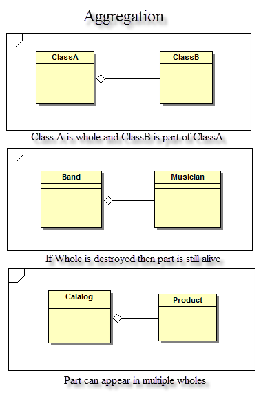
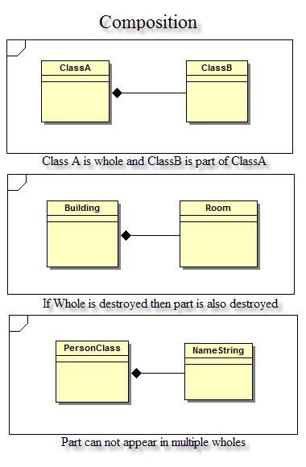
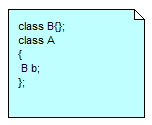
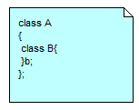

<html>
<body lang=EN-IN style='tab-interval:36.0pt'>

Composition and
Aggregation are modeled with filled diamond and hollow diamond, respectively,
on the “Whole” part.<u9:p></u9:p><o:p></o:p>

<u9:p>&nbsp;</u9:p><o:p></o:p>

<table class=MsoTableGrid border=1 cellspacing=0 cellpadding=0
 style='border-collapse:collapse;border:none;mso-border-alt:solid windowtext .5pt;
 mso-yfti-tbllook:1184;mso-padding-alt:0cm 5.4pt 0cm 5.4pt'>
 <tr style='mso-yfti-irow:0;mso-yfti-firstrow:yes'>
  <td width=529 valign=top style='width:396.5pt;border:solid windowtext 1.0pt;
  mso-border-alt:solid windowtext .5pt;padding:0cm 5.4pt 0cm 5.4pt'>
  
<b style='mso-bidi-font-weight:normal'>Aggregation (</b><b
  style='mso-bidi-font-weight:normal'>Shared Association</b><b
  style='mso-bidi-font-weight:normal'>)</b>

  </td>
  <u9:p></u9:p>
  <td width=473 valign=top style='width:354.4pt;border:solid windowtext 1.0pt;
  border-left:none;mso-border-left-alt:solid windowtext .5pt;mso-border-alt:
  solid windowtext .5pt;padding:0cm 5.4pt 0cm 5.4pt'>
  
<b style='mso-bidi-font-weight:normal'>Composition (</b><b
  style='mso-bidi-font-weight:normal'>Not-Shared Association</b><b
  style='mso-bidi-font-weight:normal'>)</b>

  </td>
 </tr>
 <u9:p></u9:p>
 <tr style='mso-yfti-irow:1'>
  <td width=529 valign=top style='width:396.5pt;border:solid windowtext 1.0pt;
  border-top:none;mso-border-top-alt:solid windowtext .5pt;mso-border-alt:solid windowtext .5pt;
  padding:0cm 5.4pt 0cm 5.4pt'>
  <ul style='margin-top:0cm' type=disc>
   <li class=MsoNormal style='color:#003300;margin-bottom:0cm;margin-bottom:
       .0001pt;line-height:18.7pt;mso-list:l1 level1 lfo3;tab-stops:list 36.0pt'>In
       cases where there's a part-of relationship between ClassA (whole or
       Collection) and ClassB (part or element).<u9:p></u9:p><o:p></o:p></li>
   <li class=MsoNormal style='color:#003300;margin-bottom:0cm;margin-bottom:
       .0001pt;line-height:18.7pt;mso-list:l1 level1 lfo3;tab-stops:list 36.0pt'>Taking
       special notice that ClassB can also be aggregated by other classes in
       the application (therefore aggregation is also known as shared
       association).<u9:p></u9:p><o:p></o:p></li>
   <li class=MsoNormal style='color:#444444;margin-bottom:0cm;margin-bottom:
       .0001pt;line-height:18.7pt;mso-list:l1 level1 lfo3;tab-stops:list 36.0pt'>ClassA is not the exclusive container of ClassB, i.e. ClassA does
       not own ClassB nor is a parent-Child relationship.<o:p></o:p></li>
   <u9:p></u9:p>
   <li class=MsoNormal style='color:#444444;margin-bottom:0cm;margin-bottom:
       .0001pt;line-height:18.7pt;mso-list:l1 level1 lfo3;tab-stops:list 36.0pt'>When ClassA is deleted ClassB Does not get destroyed.<o:p></o:p></li>
  </ul>
  </td>
  <u9:p></u9:p>
  <td width=473 valign=top style='width:354.4pt;border-top:none;border-left:
  none;border-bottom:solid windowtext 1.0pt;border-right:solid windowtext 1.0pt;
  mso-border-top-alt:solid windowtext .5pt;mso-border-left-alt:solid windowtext .5pt;
  mso-border-alt:solid windowtext .5pt;padding:0cm 5.4pt 0cm 5.4pt'>
  <ul style='margin-top:0cm' type=disc>
   <li class=MsoNormal style='color:#003300;margin-bottom:0cm;margin-bottom:
       .0001pt;line-height:18.7pt;mso-list:l1 level1 lfo3;tab-stops:list 36.0pt'>The
       composition link shows that a class (container, whole) has exclusive
       ownership over other class/s (parts).<u9:p></u9:p><o:p></o:p></li>
   <li class=MsoNormal style='color:#003300;margin-bottom:0cm;margin-bottom:
       .0001pt;line-height:18.7pt;mso-list:l1 level1 lfo3;tab-stops:list 36.0pt'>There's
       a strong life cycle dependency between ClassA and ClassB, when ClassA is
       deleted then ClassB is also deleted as a result.<u9:p></u9:p><o:p></o:p></li>
   <li class=MsoNormal style='color:#003300;margin-bottom:0cm;margin-bottom:
       .0001pt;line-height:18.7pt;mso-list:l1 level1 lfo3;tab-stops:list 36.0pt'>Part
       can belong to only one whole, no sharing of part.<u9:p></u9:p><o:p></o:p></li>
  </ul>
  
<u9:p>&nbsp;</u9:p><o:p></o:p>

  </td>
 </tr>
 <tr style='mso-yfti-irow:2;height:477.05pt'>
  <td width=529 valign=top style='width:396.5pt;border:solid windowtext 1.0pt;
  border-top:none;mso-border-top-alt:solid windowtext .5pt;mso-border-alt:solid windowtext .5pt;
  padding:0cm 5.4pt 0cm 5.4pt;height:477.05pt'>
  
<u9:p>&nbsp;</u9:p><o:p></o:p>

  
<u10:shapetype id="_x0000_t75" coordsize="21600,21600" u9:spt="75" u9:preferrelative="t" path="m@4@5l@4@11@9@11@9@5xe" filled="f" stroked="f"><u10:stroke joinstyle="miter"/><u10:formulas><u10:f eqn="if lineDrawn pixelLineWidth 0"/><u10:f eqn="sum @0 1 0"/><u10:f eqn="sum 0 0 @1"/><u10:f eqn="prod @2 1 2"/><u10:f eqn="prod @3 21600 pixelWidth"/><u10:f eqn="prod @3 21600 pixelHeight"/><u10:f eqn="sum @0 0 1"/><u10:f eqn="prod @6 1 2"/><u10:f eqn="prod @7 21600 pixelWidth"/><u10:f eqn="sum @8 21600 0"/><u10:f eqn="prod @7 21600 pixelHeight"/><u10:f eqn="sum @10 21600 0"/></u10:formulas><u10:path u9:extrusionok="f" gradientshapeok="t" u9:connecttype="rect"/><u9:lock u10:ext="edit" aspectratio="t"/></u10:shapetype><u10:shape id="Picture_x0020_1" u9:spid="_x0000_i1028" type="#_x0000_t75" style="width:284.25pt;height:447pt;visibility:visible;mso-wrap-style:square"><u10:imagedata src="Images/Aggregation-1.png" u9:title=""/></u10:shape><o:p></o:p>

  </td>
  <td width=473 valign=top style='width:354.4pt;border-top:none;border-left:
  none;border-bottom:solid windowtext 1.0pt;border-right:solid windowtext 1.0pt;
  mso-border-top-alt:solid windowtext .5pt;mso-border-left-alt:solid windowtext .5pt;
  mso-border-alt:solid windowtext .5pt;padding:0cm 5.4pt 0cm 5.4pt;height:477.05pt'>
  
<u9:p>&nbsp;</u9:p><o:p></o:p>

  
<u10:shape id="Picture_x0020_5" u9:spid="_x0000_i1027" type="#_x0000_t75" style="width:285pt;&#13;&#10;   height:435pt;visibility:visible;mso-wrap-style:square"><u10:imagedata src="Images/Composition-1.png" u9:title=""/></u10:shape><o:p></o:p>

  </td>
 </tr>
 <tr style='mso-yfti-irow:3;mso-yfti-lastrow:yes;height:98.35pt'>
  <td width=529 valign=top style='width:396.5pt;border:solid windowtext 1.0pt;
  border-top:none;mso-border-top-alt:solid windowtext .5pt;mso-border-alt:solid windowtext .5pt;
  padding:0cm 5.4pt 0cm 5.4pt;height:98.35pt'>
  
<u10:shape id="Picture_x0020_7" u9:spid="_x0000_i1026" type="#_x0000_t75" style="width:114pt;&#13;&#10;   height:93.75pt;visibility:visible;mso-wrap-style:square"><u10:imagedata src="Images/Aggregation-2.png" u9:title=""/></u10:shape><o:p></o:p>

  </td>
  <td width=473 valign=top style='width:354.4pt;border-top:none;border-left:
  none;border-bottom:solid windowtext 1.0pt;border-right:solid windowtext 1.0pt;
  mso-border-top-alt:solid windowtext .5pt;mso-border-left-alt:solid windowtext .5pt;
  mso-border-alt:solid windowtext .5pt;padding:0cm 5.4pt 0cm 5.4pt;height:98.35pt'>
  
<u10:shape id="Picture_x0020_6" u9:spid="_x0000_i1025" type="#_x0000_t75" style="width:114.75pt;height:90.75pt;&#13;&#10;   visibility:visible;mso-wrap-style:square"><u10:imagedata src="Images/Composition-2.png" u9:title=""/></u10:shape><o:p></o:p>

  </td>
 </tr>
</table>

<u9:p>&nbsp;</u9:p><o:p></o:p>

<u9:p>&nbsp;</u9:p><o:p></o:p>

<u9:p>&nbsp;</u9:p><o:p></o:p>

<u9:p>&nbsp;</u9:p>

</body>

</html>
