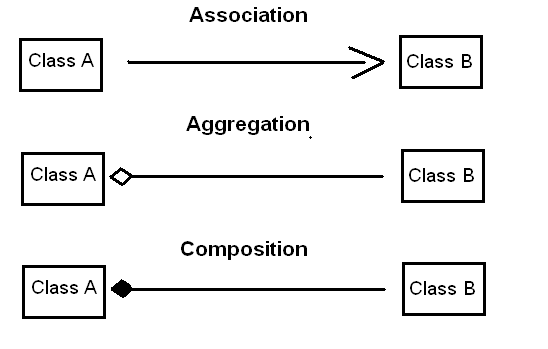

# Association #

## Association:(has-a) ##

Association is a relationship where all object have their own life cycle and there is no owner. Here is no ownership between the objects, also both have their own life cycle. Both can create and delete independently.

Ex. Teacher and Students. Multiple students can associate with single teacher and vice a versa.  

```c++
//ASSOCIATION
public class Order {
    private Customer customer
}
```

## Aggregation:(has-a + whole-part) ##

Aggregation is a specialised form of Association where all objects have their own life cycle, but there is ownership, the child object can not belongs to another parent object. If parent object is deleted, Than also child object continues to live.

Ex. Specialized department and Teacher. A single teacher can not belong to multiple departments, but if we delete the department teacher object will not be destroyed.

Ex. Car(Department) and car parts(Teacher). We can think of Car as a whole entity and Car Wheel as part of the Car.  The wheel can be created weeks ahead of time, and it can sit in a warehouse before being placed on a car during assembly.

(Teachers)Will exist if the (department)Whole is destroyed. 

```C++
class City {
    private List<Tree> trees;
    private List<Car> cars
}
```

## Composition: (has-a + whole-part + ownership) ##

Composition is again specialize form of Aggregation, where Child object dose not have their life cycle and if parent object is deleted, all child object will also be deleted. The child object dies with the owner-parent object.

Ex. A software firm(House) that is composed of different Business Units(Rooms) like Storage BU, Networking BU. Automotive BU. The life time of these Business Units(Rooms) is governed by the lifetime of the organization(House).


``` C++
class Person {
    private Heart heart;
    private List<Hand> hands;
}
```

## Association  ##

A uses B, A is related to B in a given way

## Aggregation ##

A owns B, B belongs to A

## Composition ##

A consists of B; B is a part of A and hence cannot exist without A




