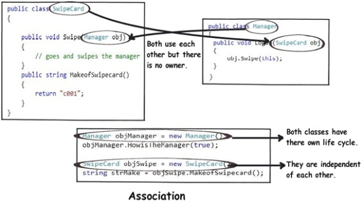
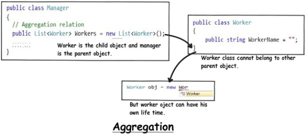
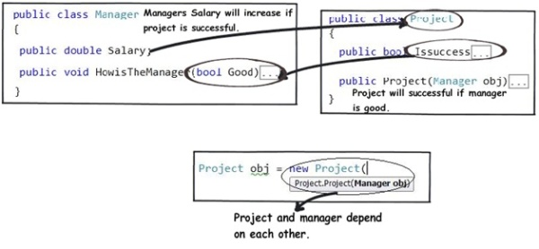
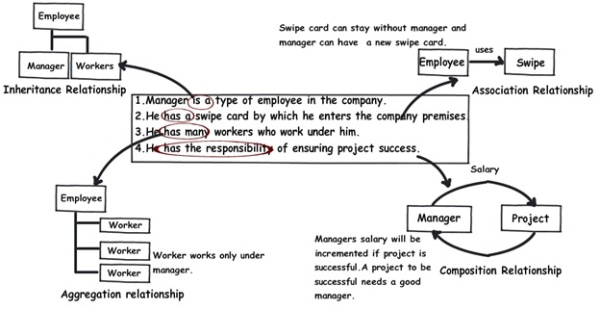

#Extracting real world relationships from a requirement

The whole point of OOP is that your code replicates real world objects, thus making your code readable and maintainable. When we say real world, the real world has relationships. Let’s consider the simple requirement listed below:

- Manager is an employee of XYZ limited corporation.
- Manager uses a swipe card to enter XYZ premises.
- Manager has workers who work under him.
- Manager has the responsibility of ensuring that the project is successful.
- Manager's salary will be judged based on project success.

#####**If you flesh out the above five point requirement, we can easily visualize four relationships:-**

- Inheritance
- Aggregation
- Association
- Composition

Let’s understand them one by one.

#Requirement 1: The IS A relationship

If you look at the first requirement (Manager is an employee of XYZ limited corporation), it’s a parent child relationship or inheritance relationship. The sentence above specifies that Manager is a type of employee, in other words we will have two classes:

parent class **Employee**, and a child class **Manager** which will inherit from the **Employee** class.

#Requirement 2: The Using relationship: Association

Requirement 2 is an interesting requirement (Manager uses a swipe card to enter XYZ premises). In this requirement, the manager object and the swipe card object use each other but they have their own object life time. In other words, they can exist without each other. The most important point in this relationship is that there is no single owner.

The above diagram shows how the **SwipeCard** class uses the **Manager** class and the **Manager** class uses the **SwipeCard** class. You can also see how we can create objects of the **Manager** class and **SwipeCard** class independently and they can have their own object life time.

This relationship is called the "Association" relationship.

#Requirement 3: The Using relationship with Parent: Aggregation

The third requirement from our list (Manager has Workers who work under him) denotes the same type of relationship like association but with a difference that one of them is an owner. So as per the requirement, the **Manager** object will own **Worker** objects.

The child **Worker** objects can not belong to any other object. For instance, a **Worker** object cannot belong to a **SwipeCard** object.

But… the **Worker** object can have its own life time which is completely disconnected from the **Manager** object. Looking from a different perspective, it means that if the **Manager** object is deleted, the **Worker** object does not die.

This relationship is termed as an "Aggregation" relationship.

#Requirements 4 and 5: The Death relationship: Composition

The last two requirements are actually logically one. If you read closely, the requirements are as follows:

- Manager has the responsibility of ensuring that the project is successful.
- Manager's salary will be judged based on project success.

Below is the conclusion from analysing the above requirements:

- Manager and the project objects are dependent on each other.
- The lifetimes of both the objects are the same. In other words, the project will not be successful if the manager is not good, and the manager will not get good increments if the project has issues.

Below is how the class formation will look like. You can also see that when I go to create the project object, it needs the manager object.

This relationship is termed as the composition relationship. In this relationship, both objects are heavily dependent on each other. In other words, if one goes for garbage collection the other also has to be garbage collected, or putting from a different perspective, the lifetime of the objects are the same. That’s why I have put in the heading “Death” relationship.

#Putting things together

Below is a visual representation of how the relationships have emerged from the requirements.

[http://www.codeproject.com/Articles/330447/Understanding-Association-Aggregation-and-Composit](http://www.codeproject.com/Articles/330447/Understanding-Association-Aggregation-and-Composit "Original Reference URL")