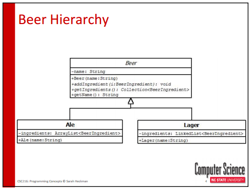
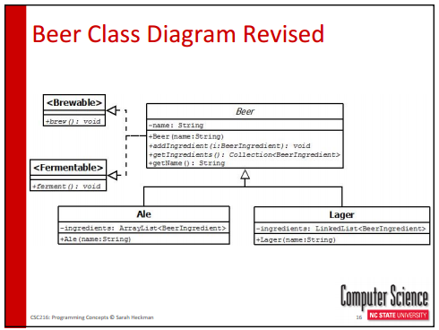

# Interfaces #

+	A set of methods that classes can promise to implement, allowing you to treat those classes similarly in your code
	+	An interface is a contract that a subclass MUST have the listed behaviors
+	If an object implements an interface, the object has certain known behavior
	+	Still can take advantage of polymorphism
+	Classes can implement multiple interfaces

+	Interfaces define what something **can do**
+	A class defines what something **is**
+	The interface advertises the services and explains how to ask for them.

## Example: ##
A Deeper Look at Beer
+	Beer is a very general name for lots of different types of beverages
+	Beers fall into two high level categories
	+	Ales: top fermenting yeast with fermentation range around room temp
	+	Lagers: bottom fermenting yeast with fermentation range between 46-59°F
+	Ales and Lagers would add different types of ingredients particularly yeast

What are things Beer **can do**?

What are the adjectives associated with Beer?
+	Drinkable
+	**Brewable**
+	**Fermentable**

# Class #

The term class is used to describe a set of like things. It describes elements of things in a general way but allows each instance of the class to vary in non essential features. Whereas the class is abstract and conceptual, the instances are concrete, physical objects. The visual image that appears to us at the mere mention of a tree contains the essential features that enable us to recognize any of the instances of tree when we see one. 

In addition to its role as an object factory, it provides information and services to other objects through its own interface. Often, its only clients are the instances that it has produced, but in other cases, it acts as the sole provider of data and services to a number of different kinds of objects.

Every Object instantiated from a Class will have a state and a behaviour. The details of how the instantiated Object perform a task are pinned down in the instance's class definition. By browsing the instance's class and its instance methods, you can see whether the instance performs its responsibilities alone or delegates portions of its task to other objects in its neighbourhood.
These objects will communicate with other Objects in their virtual world using behaviour defined in class. 

