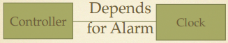
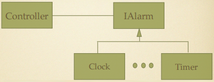

# Selecting Classes #

+ Controller needs an alarm
+ Clock has it, so why not use it?
+ Concrete Controller depends on concrete Clock
+ Changes to Clock affect Controller
+ Hard to make Controller use different alarm (fails OCP)
+ Clock has multiple responsibilities (fails SRP)

+ Dependency has been inverted
+ Both Controller and Clock depend on
+ Abstraction (IAlarm)
+ Changes to Clock does not affect Controller
+ Better reuse results as well
