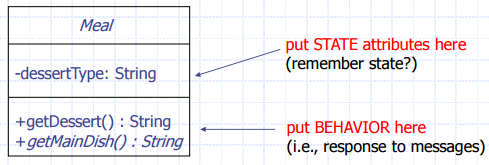
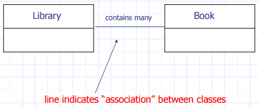
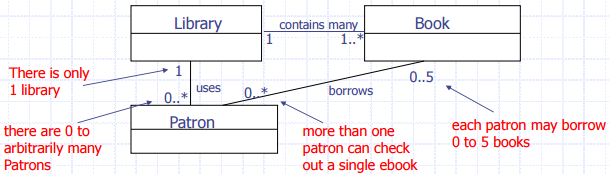
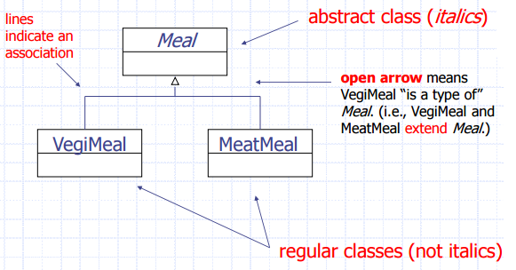
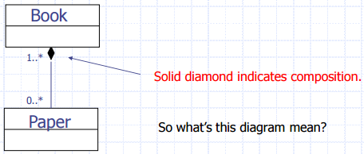
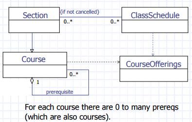

# UML Class Diagrams #

+	Represent a class as a rectangle.
+	Put name in Rectangle (italic if abstract)
+	Put methods and variables in lower rectangles as needed (+ if public, - if private)

## Association ##

Draw a line to indicate a relationship.

**When do you draw an association?**

Draw an association when some object of class A has to know about an object of class B.
+	When an object of class A sends a message to an object of class B
+	When class A creates or contains an object of class B
	+	if "B myObject = new B()" happens inside of class A
+	When class A receives a message containing an object of class B as an argument.

## Multiplicity ##

## Inheritance (or Generalization) ##

## Aggregation ##

Aggregation is when a class is part of another class.
+	A Building contains People
+	An Airport contains Aircraft
+	A Library contains Books
+	It could contain none at all(Empty Building)

AND People, Aircraft, and Books don’t disappear if we delete the Building, Airport, and Library.

Aggregation is usually a collection of things.
+	ResidentList
+	Forest (aggregates trees)

## Composition ##

In composition the parts disappear if we erase the whole.

Book contains Pages
+	Deleting the Book class would eliminate the instances of the Pages as well.
+	We say that "the Book wholly owns the Pages"
+	The Pages have no reason to exist without the book.

## Dependency ##

A dependency is a relation between two classes in which a change in one may force a change in the other.

You should always show your dependencies in UML diagrams

