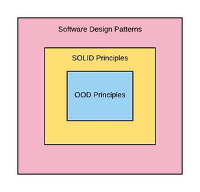

#Introduction

S.O.L.I.D principles are the set of principle fist given by Robert.C.Martin. 

SOLID software system means its allows to build system that is

- Easy to maintain
- Easy to extend
- Easy to understand
- Easy to implement
- Easy to explain

SOLID principles are related with the design and maintenance of software system. Most of the developer mix SOLID principles with OOD principles and Design patterns. Below image that removes confusion of OOD principles and Design patterns

- **OOD Principle** (Abstraction, Encapsulation, Inheritance, Polymorphism)
- **SOLID principle**
- **Software Design Patterns** (GOF patterns)

#S.O.L.I.D is acronym for

###Single Responsibility Principle
This principle is about Creation.

Principle is related to **Designing software module** - a class or a function.

###Open/Close Principle
This principle is about extending functionality.

Principle is related to **Designing software module** - a class or a function.

Principle is applied after Single Responsibility Principle

###Liskov Substitution Principle
This principle is about relationship i.e. inheritance.

Principle is related to **substitution of child in place of its parent**. 

###Interface Segregation Principle
Principle is about **efficient interface design**.

###Dependency Inversion Principle
This principle is about **creating loosely coupled system**.

