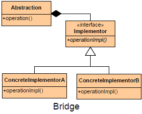
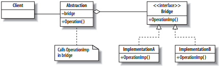

# Bridge #

## Intent ##/Purpose

> Separates an abstraction( ro interface) from its implementation, allowing implementations and abstractions to vary independently of one another.

## Image ##

## Use Bridge When ##

+ Abstractions and implementations should not be bound at compile time.
+ Abstractions and implementations should be independently extensible.
+ You want run-time binding of the implementation.
+ Changes in the implementation of an abstraction should have no impact on clients.
+ Implementation details should be hidden from the client.

## Participants ##

+ Abstraction
  + The interface that the client sees
  + maintains a reference to an object of type Implementor.
+ Implementor/Bridge
  + An interface defining those parts of the Abstraction that might vary
+ RefinedAbstractio/AbstractionImpl
  + extends the interface defined by Abstraction.
  + Implements the abstraction interface using a reference to an object of type Implementor.
+ ImplementationA and ImplementationB
  + Implementations of the Bridge interface
+ Operation
  + A method that is called by the client
+ OperationImp
  + A method in the Bridge that is called from the Operation in the Abstraction

## Motivation ##

+ Need to avoid a permanent binding between an abstraction and implementation.
+ When abstractions and implementations should be extensible through subclassing.
+ When implementation changes should not impact clients.
+ When the implementation should be completely hidden from the client.
+ When you have a proliferation of classes.
+ When, unknown to the client, implementations are shared among objects.
+ The changes in actual implementation should be transparent to the client.
+ The details of implementation is only seen by concrete implementers and hidden from abstraction.
+ We should be able to extend both abstraction and implementation independent of each other.
+ When the implementation has to be shared among multiple objects without client knowledge.

## Benefits ##

**Decoupling abstraction from implementation** - Inheritance tightly couples an abstraction with an implementation at compile time. Bridge pattern can be used to avoid the binding between abstraction and implementation and to select the implementation at run time.

**Reduction in the number of sub classes** - Sometimes, using pure inheritance will increase the number of sub classes. Let us assume that the full-blown version of our Image Viewer supports 6 image formats in 3 different operating systems. Pure inheritance would have resulted in 18 sub classes whereas applying Bridge Pattern reduces the sub class requirement only to 9.

**Cleaner code and Reduction in executable size** - In the above example, operating system specific code is encapsulated in CImageImp sub classes. This results in a cleaner code without much preprocessor statements like #ifdefs, #ifndefs. Also, it is easy to conditionally compile CImageImp sub classes for a given operating system to reduce the size of the executable.

**Interface and implementation can be varied independently** - Maintaining two different class hierarchies for interface and implementation entitles to vary one independent of the other.

**Improved Extensibility** - Abstraction and implementation can be extended independently. As mentioned earlier, the above example can easily be extended to view other image formats on Windows or view BMP images on other operating systems.

**Loosely coupled client code** - Abstraction separates the client code from the implementation. So, the implementation can be changed without affecting the client code and the client code need not be compiled when the implementation changes. (NOTE : In the above mentioned example, for the sake of simplicity, the application configures the CImage object with the right CImageImp object. However, alternate methods like Abstract Factory can be adopted to choose the CImageImp object.)

## Drawbacks ##

**Double indirection** - This will have a slight impact on performance.
