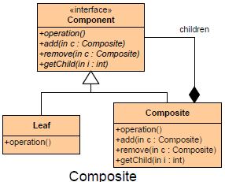

README

## Definition ##

Compose objects into tree structures to represent part-whole hierarchies. Composite lets clients treat individual objects and compositions of objects uniformly.

## Purpose ##

Facilitates the creation of object hierarchies where each object can be treated independently or as a set of nested objects through the same interface.

## Intent ##

+	Compose objects into tree structures to represent part-whole hierarchies.
+	Composite lets clients treat individual objects and compositions of objects uniformly.

##

## Participants ##

The classes and/or objects participating in this pattern are:

+	Component   (DrawingElement)

		-	Declares the interface for objects in the composition.
		-	Implements default behavior for the interface common to all classes, as appropriate.
		-	Declares an interface for accessing and managing its child components.
		-	(optional) Defines an interface for accessing a component's parent in the recursive structure, and implements it if that's appropriate.
+	Leaf   (PrimitiveElement)

		-	Represents leaf objects in the composition. A leaf has no children.
		-	Defines behavior for primitive objects in the composition.
+	Composite   (CompositeElement)

		-	Defines behavior for components having children.
		-	Stores child components.
		-	Implements child-related operations in the Component interface.
+	Client  (CompositeApp)

		-	Mzanipulates objects in the composition through the Component interface.

## Use Composite when ##

+	Hierarchical representations of objects are needed.
+	Objects and compositions of objects should be treated uniformly.

## Consequences ##

**Benefits**

+	It makes it easy to add new kinds of components
+	It makes clients simpler, since they do not have to know if they are dealing with a leaf or a composite component

**Potential Drawbacks**

+	It makes it harder to restrict the type of components of a composite
