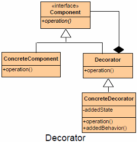

README

## Definition
Attach additional responsibilities and behaviors to an object dynamically. Decorators provide a flexible alternative to subclassing for extending functionality. 

## Purpose

Allows for the dynamic wrapping of objects in order to modify their existing responsibilities and behaviors.

## Intent

*	The Decorator pattern enables new behavior to be added to an object dynamically via composition. The pattern achieves this by either inheriting from the same base class or implementing a shared interface in conjunction with injecting an instance of the class to be decorated. 
*	In other words, the Decorator pattern is the process of wrapping an existing class with another class that extends the behavior or state. Multiple decorators can be added to a class to combine extended behavior.

##

##

## Participants

+	The Component(IProduct) defines the interface for a product. The ConcreteComponent and Decorator must implement this interface.
+	The ConcreteComponent(DefaultProduct) Defines an object to which additional responsibilities and behaviors can be attached.
+	The Decorator(ProductDecorator) implements the Component(IProduct) interface and is injected with a reference to an Component(IProduct) instance that enables the inner instance to be wrapped.
+	ConcreteDecorator inherits from Decorator(ProductDecorator) and add state and new behavior to the Component(IProduct) instance.

##Use Decorator when
+	 Object responsibilities and behaviors should be dynamically modifiable.
+	 Concrete implementations should be decoupled from responsibilities and behaviors.
+	 Subclassing to achieve modification is impractical or impossible.
+	 Specific functionality should not reside high in the object hierarchy.
+	 A lot of little objects surrounding a concrete implementation is acceptable.

## CONSEQUENCES

**Benefits**

+	Decorator design pattern provide more flexibility than the standard inheritance.(Inheritance also extends the parent class responsibility but in a static manner. However decorator allows doing this in dynamic fashion.)
+	The decorator pattern can be used to make it possible to add and remove (decorate) the functionality of a certain object without affecting other object at runtime.
+	Avoids feature laden classes high in hierarchy

**Potential Drawbacks**

+	Lots of little objects
+	Interface conformance

