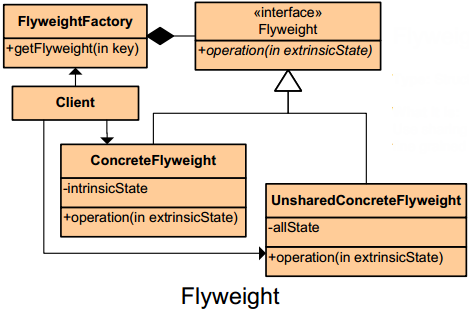

README

## Definition ##

	Use sharing to support large numbers of fine-grained objects efficiently.

## Purpose ##

	Facilitates the reuse of many fine grained objects, making the utilization of large numbers of objects more efficient.

## Intent ##

	Use sharing to support large numbers of fine-grained objects efficiently.

##

## Participants ##

+	Flyweight
		Declares an interface through which flyweights can receive and act on extrinsic state
+	ConcreteFlyweight
		Implements Flyweight interface and adds storage for intrinsic state
+	UnsharedConcreteFlyweight
		Not all flyweights need to be shared, unshared flyweights typically have children which are flyweights
+	FlyweightFactory
		Generates and manages flyweight objects
+	Client
		Maintains extrinsic state and stores references to flyweights

## Use Composite when ##

Apply flyweight when ALL of the following are true:
+	An application uses a large number of objects
+	Storage cost is high because of the quantity of objects
+	Most objects can be made extrinsic
+	Many groups of objects can be replaced by relatively few shared
+	objects once extrinsic state is removed
+	The application does not depend on object identity

## Consequences ##

**Benefits**
+	Space saving by using shared objects
+	Adds functionality to the application

**Potential Drawbacks**
+	Flyweights may introduce run-time costs associated with transferring, finding, and/or computing extrinsic state

## Collaborations ##

+	Data that a flyweight needs to process must be classified as intrinsic or extrinsic
		Intrinsic is stored with flyweight; Extrinsic is stored with client
+	Clients should not instantiate ConcreteFlyweights directly

## Additional Notes ##

**The flyweight pattern is used to reduce the number of objects you need in your application.**
	This is accomplished by dividing an object’s internal state into two categories, **intrinsic data** and **extrinsic data*.
		*Intrinsic data* is the information that is required by the internal methods of a class. The class cannot function properly without this data.
		*Extrinsic data* is information that can be removed from a class and stored externally.

**We can take all of the objects that have the same intrinsic state and replace them with a single shared object, thus reducing the number of objects down to the number of unique intrinsic states you have.**

**Flyweight Factory**
	Instead of using a normal constructor, a factory is used to create these shared objects. That way, you can track the objects that have already been instantiated and **only create a new copy** if the needed intrinsic state is different from an object you already have.

**Role of Manager in FlyWeight** (can be client(main) also)
	A manager object is used to store the object’s extrinsic state. When invoking any of the objects’ methods, the manager will pass in these extrinsic states as argument.

## Intrinsic and Extrinsic State ##

	Categorizing an object’s data as intrinsic or extrinsic can be a bit arbitrary.
	You want to make as much of the data as possible extrinsic while still maintaining the modularity of each object. This distinction can be somewhat arbitrary. In this example, the physical car data (make, model, year) is intrinsic, and the owner data (owner name, tag number, last registration date) is extrinsic. This means that only one car object is needed for each combination of make, model, and year. This is still a lot of objects, but it is several orders of magnitude fewer than before. The single instance of each make-model-year combination will be shared among all the owners of that type of car. Here is what the new Car class looks like.

## Instantiation Using a Factory ##

	The factory is fairly simple. It checks to see whether a car of this particular make-model-year combination has been created before. If so, it returns it. If not, it creates a new car and stores it for later use. This ensures that only a single copy of each unique intrinsic state is created

## Extrinsic State Encapsulated in a Manager ##

	One more object is needed to finish this optimization. All of the data that was removed from the Car objects has to be stored somewhere; you use a singleton as a manager to encapsulate that data. Each of the old-style Car objects is now split into the extrinsic data and the reference to the shared car object that the data belongs to. The combination of a Car object and the owner data will be referred to as a car record. The manager stores both of those pieces.

## Managing Extrinsic State ##

	There are many different ways to manage a flyweight object’s extrinsic state. One common way is to use a manager object, which contains a centralized database of the extrinsic states and the flyweight object they belong to. It has the advantage of being simple and easy to maintain. It’s also a fairly lightweight approach, since you are only using a single array or object literal to store the extrinsic data.

## When Should the Flyweight Pattern Be Used? ##

There are a few conditions that should be met before attempting to convert your objects to flyweights. Your page must use a large number of resource-intensive objects. This is the most important condition; it isn’t worth performing this optimization if you only expect to use a few copies of the object in question. How many is a “large number”? Browser memory and CPU usage can both potentially limit the number of resources you can create. If you are instantiating enough objects to cause problems in those areas, it is certainly enough to qualify. The next condition is that at least some of the data stored within each of these objects must be able to be made extrinsic. This means you must be able to move some internally stored data outside of the object and pass it into the methods as an argument. It should also be less resource-intensive to store this data externally, or you won’t actually be improving performance. If an object contains a lot of infrastructure code and HTML, it will probably make a good candidate for this optimization. If it is nothing more than a container for data and methods for accessing that data, the results won’t be quite so good. The last condition is that once the extrinsic data is removed, you must be left with a relatively small number of unique objects. The best-case scenario is that you are left with a single unique object, as in the calendar and tooltip examples. It isn’t always possible to reduce the number of instances down to one, but you should try to end up with as few unique instances of your object as possible. This is especially true if you need multiple copies of each of these unique objects, as in the dialog box example.

## Notes ##

Reference From: "JavaScript Design Patterns: The Essentials of Object-Oriented JavaScript Programming"
http://www.amazon.com/Pro-JavaScript-Design-Patterns-Object-Oriented/dp/159059908X
