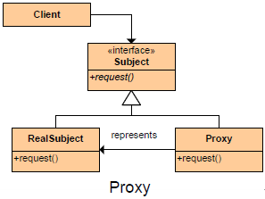

##Intent/Purpose
	Provide a surrogate or placeholder for another object to control access to it.
	
##

##
	
##Participants

+	The **Client** depends on the abstract Subject. Both the RealSubject and the Proxy implement the same interface, so the client is unaware of which she is using. 
+	The **Proxy** class is the proxy for the RealSubject class. 
		+	It has the realSubject variable that points to the real object behind the scene. 
		+	It has the Operation method that encapsulate the real object's Operation method. This is the place where you can add additional logic to the real object's methods.
+	The **Subject** interface is the interface that both the Proxy class and the RealSubject class implements. It has the Operation method.
+	The **RealSubject** class is the real object behind the scene. It has the Operation method that performs the actual work.

##Use Proxy when
There are several cases where a Proxy can be useful.

+	The object being represented is external to the system.
+	Objects need to be created on demand.
+	Access control for the original object is required.
+	Added functionality is required when an object is accessed.
	
##CONSEQUENCES

**Benefits**

+	Enhanced efficiency and lower cost
+	Decoupling clients from the location of remote server components
+	Separation of housekeeping code from functionality

**Potential Drawbacks**

+	Less efficiency due to indirection
+	Complex implementation

##Types of Proxies

+	**Remote Proxy** - Hides fact that object resides in a different address space.
+	**Virtual Proxy** - Perform optimizations such as creation on demand.
+	**Copy-On-Write Proxy** - Defers copying (cloning) a target object until required by client actions. Really a form of virtual proxy.
+	**Protection (Access) Proxy and Smart References** - Allow additional housekeeping tasks when object is accessed.
+	**Cache Proxy** - Provides temporary storage of the results of expensive target operations so that multiple clients can share the results
+	**Firewall Proxy** - Protects targets from bad clients (or vice versa)
+	**Synchronization Proxy** - Provides multiple accesses to a target object
+	**Smart Reference Proxy** - Provides additional actions whenever a target object is referenced such as counting the number of references to the object